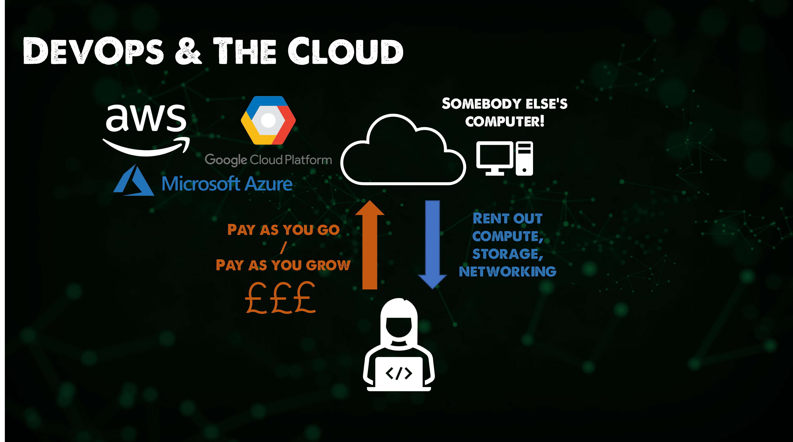
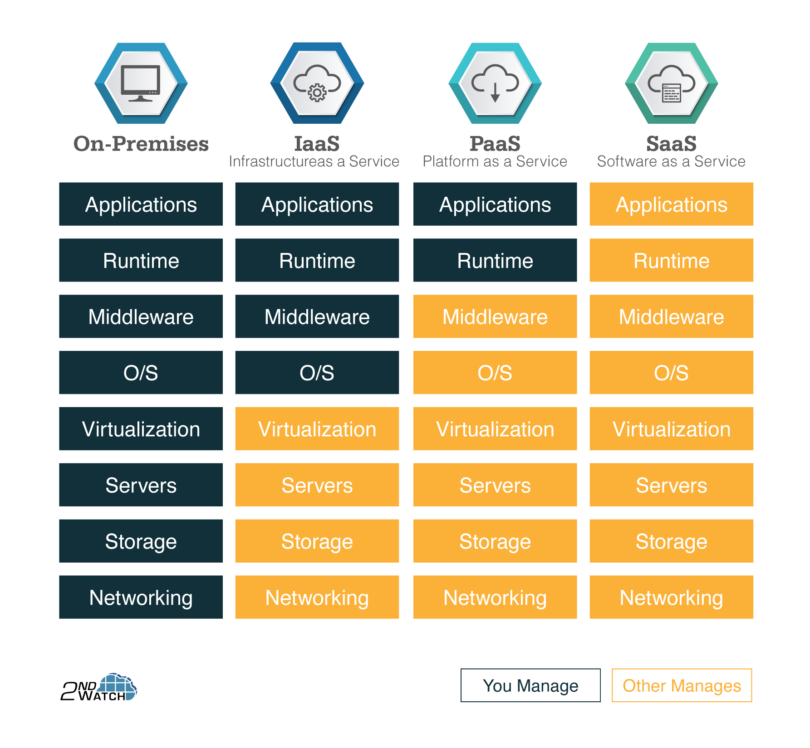

import { LinkCard } from '@astrojs/starlight/components';

_Chào mừng mọi người đến với chặng 5 của hành trình 90 ngày cùng DevOps, và chào mừng
đến với điểm dừng chân mới của chúng ta - **Điện toán đám mây**. Ở đó sẽ có rất nhiều những
câu chuyện thú vị, đặc biệt sẽ có rất nhiều kiến thức được truyền tải thông qua chặng này._

**_Hãy chuẩn bị sẵn sàng, cùng xách ba lô lên và đi thôi!_** 🎒

## Sơ nét về Điện toán đám mây

_Theo định nghĩa của Viện Tiêu chuẩn và Công nghệ Quốc gia Mỹ, Điện toán đám mây được hiểu là 
một mô hình cho phép cấp quyền truy cập đến **kho chung** chứa các tài nguyên máy tính có thể 
cấu hình được như máy chủ, bộ nhớ lưu trữ, mạng, ứng dụng, dịch vụ **theo yêu cầu** một cách
**tiện lợi, nhanh chóng, an toàn, mọi lúc mọi nơi**._

_Đám mây là tập hợp các tài nguyên CNTT truy cập được qua Mạng Internet, nó được gọi là 
mô hình **thuê tài nguyên như dịch vụ (RaaS - Resource as a Service)**._

_Như vậy, đây là một kiểu **"cho thuê"** trên không gian mạng, khá giống đi thuê căn hộ, nhà trọ
mà mọi người đang làm. Chúng ta sẽ không cần quan tâm đến việc xây dựng và bảo trì nó ra sao -
việc chúng ta quan tâm là không gian bên trong của chỗ ở. Xét dưới góc độ DevOps, đây là môi
trường để chúng ta triển khai thực tế các công cụ đã từng đề cập ở các chặng trước đó._

## Các mô hình đám mây
_Có rất nhiều mô hình cho thuê tài nguyên trên nền tảng điện toán đám mây, nhưng chúng ta sẽ 
chỉ nói về ba kiểu mô hình phổ biến nhất: **Infrastructure as a Service (IaaS), 
Platform as a Service (PaaS) và Software as a Service (SaaS).**_

_Sự khác nhau của ba mô hình có thể được phân tích như trong phần ba của Tech Blog số 4, mọi
người có thể truy cập tại **[đây](https://www.builetuananh.name.vn/blog/tech-blog-03)**._

> **Nguồn**: [2ndWatch](https://www.builetuananh.name.vn/blog/tech-blog-03)

## Các định dạng đám mây

_Có một số dạng mô hình đám mây được sử dụng trong thực tế, được phân loại như sau:_

- _**Đám mây công cộng (Public Cloud)**: Đây là một mô hình điện toán đám mây mà người 
cung cấp dịch vụ sẽ cung cấp tài nguyên cho người dùng thông qua Internet. Các ví dụ 
điển hình như: **Amazon Web Services (AWS), Microsoft Azure, Google Cloud Platform (GCP)**,
..._
- _**Đám mây riêng (Private Cloud)**: Đây là một mô hình điện toán đám mây mà người 
cung cấp dịch vụ sẽ cung cấp tài nguyên cho người dùng thông qua một mạng riêng ảo (VPN). 
Các ví dụ điển hình như: **VMware, OpenStack**, ..._
- _**Đám mây hỗn hợp (Hybrid Cloud)**: Đây là một mô hình điện toán đám mây mà người 
cung cấp dịch vụ sẽ cung cấp tài nguyên cho người dùng thông qua cả Internet và 
mạng riêng ảo (VPN). Ví dụ điển hình là **IBM Cloud**, ..._

_Trong phạm vi của Giai đoạn 5, chúng ta sẽ đi sâu vào **Đám mây công cộng** và kể cả các mô hình
của đám mây, kể cả phiên bản mới như **CaaS (Container dưới dạng dịch vụ)** hay **FaaS (Hàm dưới 
dạng dịch vụ)**._

_Ở bản Việt này, **AWS sẽ được lưa chọn**, và tại đây, một bài thực hành cụ thể sẽ được thực hiện 
nhằm cụ thể hóa mục tiêu triển khai được một ứng dụng bất kỳ trên môi trường điện toán đám mây.
Chúng ta sẽ tìm hiểu các định nghĩa liên quan đến AWS **(gần như tương tự với các nhà cung cấp khác)**
và cách chúng ta biến những điều không thể thành có thể với điện toán đám mây. **Hẹn gặp mọi người ở 
ngày tiếp theo**._ 👋

## Tài liệu tham khảo 📚

_Mời mọi người chuyển sang trang này để theo dõi tất cả tài liệu liên quan trong giai đoạn 5, 
để giúp bản thân có được những tài liệu hữu ích về Điện toán đám mây trong làm việc với DevOps._

<LinkCard
  title="Ngày 26 - Tham khảo"
  href="../../../reference/cloud/day26"
/>

_Hẹn gặp mọi người ở những ngày tiếp theo._ 🚀