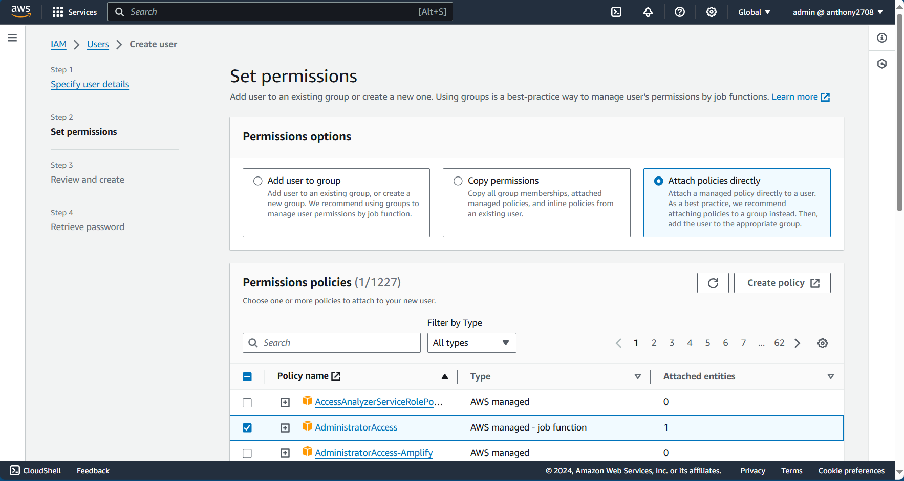

import { LinkCard } from '@astrojs/starlight/components';

_Xin chào, đây là ngày thứ 27 của hành trình 90 ngày cùng DevOps, và đây là lúc mà những định
nghĩa mở rộng hơn về điện toán đám mây sẽ được cung cấp._ 

**_Hãy sẵn sàng và khám phá nào!_** ⛺

## Các định nghĩa đầu tiên

_AWS là một dịch vụ **điện toán đám mây công cộng**, cung cấp qua Internet hoặc mạng riêng ảo (VPN).
Vùng phủ của AWS là rộng nhất trong số ba nhà cung cấp dịch vụ lớn trên thế giới với hơn **100
vùng khả dụng** tại **34 khu vực**, hàng trăm vùng biên phục vụ truy cập tốc độ cao **(trong đó có 
hai đô thị lớn của Việt Nam là Hà Nội và Thành phố Hồ Chí Minh)**, cùng số lượng dịch vụ lớn nhất 
và mô hình thanh toán trả trước. Cách tốt nhất để bắt đầu với AWS là 
**[tạo tài khoản](https://signin.aws.amazon.com/signup?request_type=register)**._

### [Khu vực](https://aws.amazon.com/vi/about-aws/global-infrastructure)

_Bản đồ dưới đây là vùng phủ sóng của AWS trên toàn thế giới. Theo thông báo từ AWS, rất có thể
trong năm 2024/25, thủ đô Hà Nội của Việt Nam sẽ trở thành **1 vùng địa phương (Local Zone)** 
của AWS ứng với khu vực Đông Nam Á (Singapore). Điều này cũng có nghĩa là, rất có thể một trong 
các đơn vị **VNPT, Viettel hoặc CMC** sẽ đứng ra hợp tác để mang một loạt các dịch vụ của AWS 
chạy trên các máy chủ tại nước ta._


> **Nguồn (ngày 02/09/2024)**: [AWS](https://aws.amazon.com)

_AWS cũng cung cấp riêng các đám mây cho **Chính phủ Mỹ** cũng như khu vực **Trung Quốc đại lục** 
tách biệt với phần còn lại của thế giới. Tất nhiên, ở mỗi khu vực, số lượng dịch vụ và giá cả cũng
sẽ có sự khác biệt._

### [Vùng khả dụng](https://aws.amazon.com/vi/about-aws/global-infrastructure/regions_az)

_Mỗi khu vực sẽ có tối thiểu ba vùng khả dụng (AZ). Đây là các **trung tâm dữ liệu lớn** được đặt ở những
nơi khác nhau, với mục tiêu cung cấp giải pháp dự phòng cho các tình huống sự cố xảy ra với hệ thống._


## Khởi động với IAM

_Sau khi tạo tài khoản và đăng nhập bằng email, hãy **tạo thêm một tài khoản khác (ủa, sao phải tạo thêm?)**_

_Lý do cho đề xuất này là bởi lẽ, việc tạo thêm tài khoản IAM sẽ giúp chúng ta phân lập quyền trên AWS tốt hơn,
tránh các vấn đề về bảo mật liên quan và là một giải pháp chuẩn bị cần thiết cho việc mở rộng (nếu có)._

_Hãy xem tài khoản email của bạn trên AWS là ```root``` trên Linux. Tất nhiên là chả ai muốn phải vào root
trước rồi mới dùng lệnh này nọ, khá nguy hiểm. Biện pháp tốt nhất là cấp quyền cho một tài khoản bình thường 
sẽ được chạy các lệnh tương tự ```root```, ví dụ như ```admin``` chẳng hạn._

_Truy cập vào mục IAM trên AWS. Chọn **Người dùng (Users)** ở bên trái màn hình, sau đó chọn **Tạo người dùng 
(Create User)**._


_Sau đó nhập tên người dùng, rồi chọn tiếp quyền **Admin**. Lưu ý, cần phải chọn yêu cầu **cho phép vào Console** 
để có thể tương tác qua giao diện (**lúc này hệ thống sẽ yêu cầu nhập mật khẩu xác thực**)._




_Xem lại trước khi nhấn nút tạo tài khoản. Cuối cùng, đăng xuất tài khoản email và **đăng nhập bằng tài khoản IAM**._


**_Hoàn tất quá trình tạo tài khoản làm việc, kết thúc nội dung ngày 27._** ✅

## Tài liệu tham khảo 📚

_Mời mọi người chuyển sang trang này để theo dõi tất cả tài liệu liên quan trong giai đoạn 5, 
để giúp bản thân có được những tài liệu hữu ích về Điện toán đám mây trong làm việc với DevOps._

<LinkCard
  title="Ngày 27 - Tham khảo"
  href="../../../reference/cloud/day26"
/>

_Hẹn gặp mọi người ở những ngày tiếp theo._ 🚀