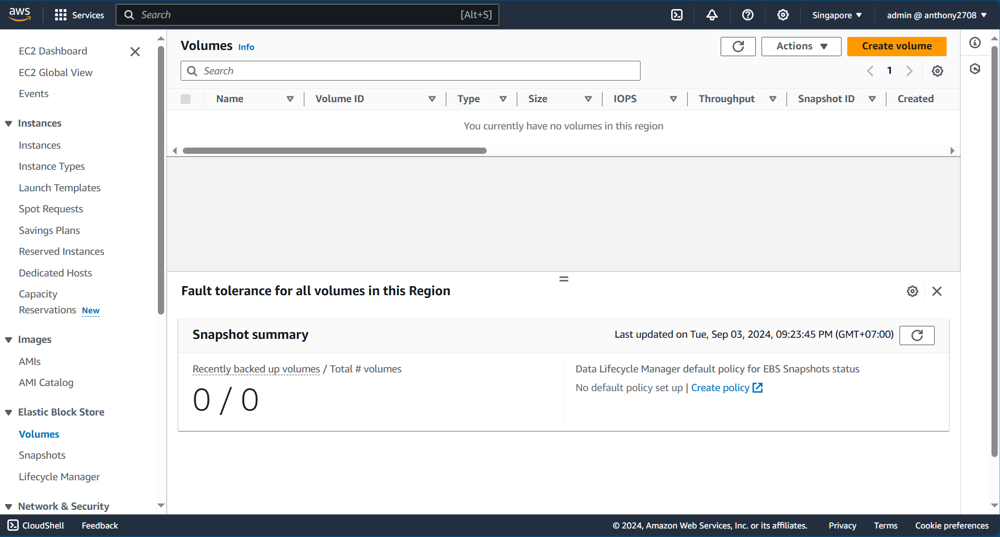
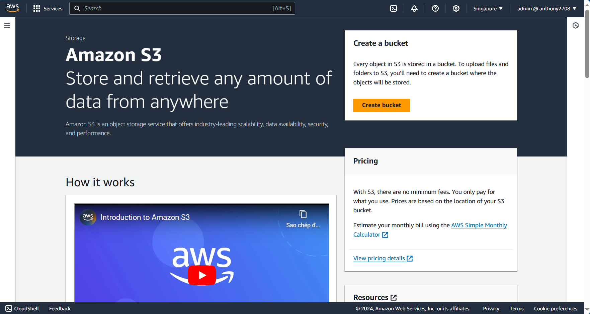
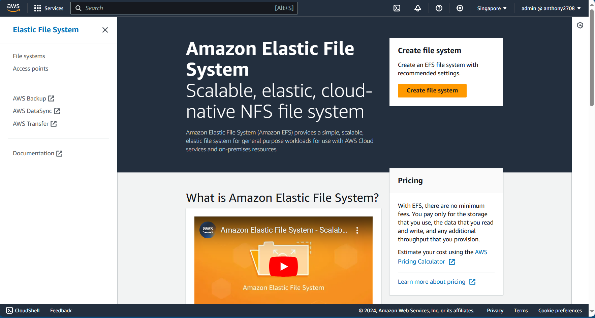
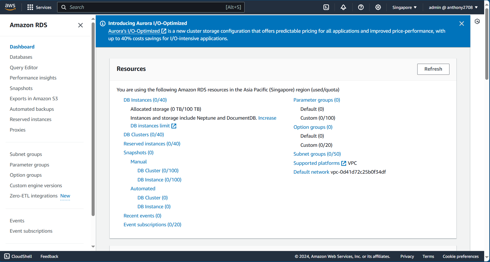
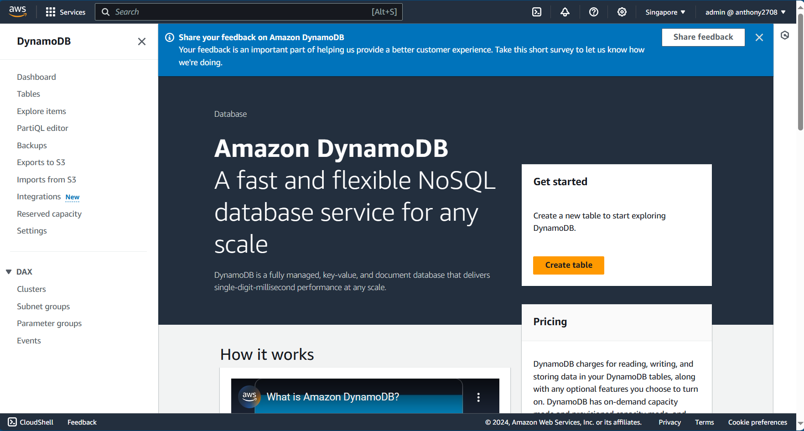
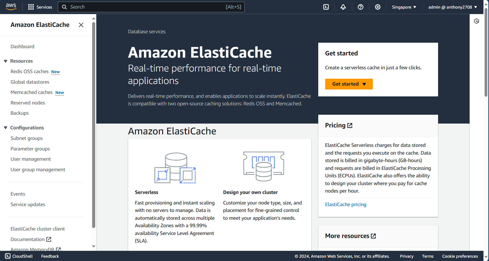

import { LinkCard } from '@astrojs/starlight/components';

_Xin chào mọi người, ngày tiếp theo của hành trình đã sẵn sàng rồi đây. Đã đến lúc chúng ta khai
thác những chủ đề mới hơn về các dịch vụ lưu trữ cũng như Cơ sở dữ liệu của AWS._

**_Nào, xin mời lên đường!_** 🏕

## Các dịch vụ lưu trữ

_Trên AWS có **ba loại lưu trữ khác nhau**, phục vụ cho nhiều mục đích sử dụng._

### Lưu trữ dạng khối (EBS)

_Thường là lưu trữ trên hệ thống máy ảo, lưu trữ liên tục và có bản dự phòng. Có phục vụ cả SSD và
HDD với các tiện ích sau._

- _Hỗ trọ lưu Snapshot (bản ghi tạm thời) và bản cài (Image)_
- _Có thể di chuyển giữa các máy khác nhau._
- _Thu phí dựa trên **kích thích cũa đĩa** thay vì dung lương đã sử dụng._ 

_Tất nhiên có một định nghĩa quan trọng cần nhắc tới là **IOPS (Số thao tác đọc/ghi trên giây)**. Mỗi
loại ổ đĩa với kích thước và chủng loại khác nhau sẽ cung cấp thông số này khác nhau._

### Lưu trữ dạng đối tượng (S3)

_Cái này thì lại được sử dụng nhiều hơn, với AWS chính là **S3**. Với cái tên S3 và mục đích là lưu trữ
kiểu đối tượng, mỗi lần gọi đến một tập tin tương ứng **gọi một đối tượng bất kỳ**. Điều này có nghĩa là
nó có thể được sử dụng cho gần như mọi thể loại, từ web đến lưu trữ, di động, thiết bị thông minh, dữ
liệu lớn, v.v..._

### Lưu trữ dạng tập tin (EFS)

_Khá giống **hệ thống tập tin** ta đang sử dụng trên máy tính, EFS cung cấp giải pháp gần như tương tự nhưng 
trên điện toán đám mây. Có khả năng mở rộng đến **petabytes (PB)** dữ liệu mà không gây ảnh hưởng đến hiệu
năng, phục vụ **trong và liên vùng khả dụng** chỉ với việc sử dụng kết nối qua VPN hoặc Direct Connect._

### Lưu trữ Đệm

_**CloudFront**, sản phẩm CDN hàng đầu của AWS, cung cấp giải pháp truy cập dữ liệu với trải nghiệm gần nhất
với người dùng. CloudFront có hai điểm biên tại **Hà Nội** và **Hồ Chí Minh**, đồng nghĩa với việc nếu kích hoạt 
có thể giúp cải thiện hiệu năng cho người dùng truy cập dữ liệu tại Việt Nam._

## Các dịch vụ Cơ sở dữ liệu

_Thứ khiến các lập trình viên, những người làm Công nghệ thông tin, từ lớn đến nhỏ, phải thật sự đau đầu. Nhưng với 
**Điện toán đám mây**, có vẻ nó không đau đầu lắm..._

### SQL (CSDL Quan hệ)

_Nhắc tới SQL thì AWS có **RDS**, cung cấp dịch vụ theo dạng SQL đối với các loại như **MySQL/MariaDB, Postgres,
SQL Server, v.v...**_

- _Cho phép truy cập trực tiếp qua UI hoặc qua phần mềm bên thứ ba tương ứng._
- _Có thể mở rộng thành cụm Cơ sở dữ liệu._
- _Có thể sao lưu tự động, chụp ảnh phục hồi, v.v..._

### NoSQL (CSDL phi quan hệ)

:::caution

**_NoSQL là Not-only SQL, KHÔNG PHẢI NO-SQL!!!_**

:::

_**DynamoDB** là một dạng NoSQL được AWS cung cấp, ngoài ra còn có **DocumentDB** chạy trên nền **MongoDB** 
(**nhưng là bản cũ**). Hỗ trợ nhiều mô hình dữ liệu hơn, cũng như **khóa phân vùng** để phục vụ chia dữ liệu._

### Cơ sở dữ liệu đệm

_Người ta nói, một trang web để tải nhanh nên lưu sẵn những dữ liệu người dùng thường xuyên truy cập, gọi là đệm.
Với AWS, **ElastiCache** cung cấp giải pháp cơ sở dữ liệu dạng đệm với hai loại là **Redis** và **Memcached**._

_Thậm chí, AWS còn cung cấp **MemoryDB** như một giải pháp dạng "**bia kèm lạc**" cho **Redis**._

**_Chúng ta sẽ dần đi sâu vào sử dụng hàng loạt các dịch vụ này ở những ngày tiếp theo. 
Còn đây là phần kết của ngày 29._** ✅

## Tài liệu tham khảo 📚

_Mời mọi người chuyển sang trang này để theo dõi tất cả tài liệu liên quan trong giai đoạn 5, 
để giúp bản thân có được những tài liệu hữu ích về Điện toán đám mây trong làm việc với DevOps._

<LinkCard
  title="Ngày 29 - Tham khảo"
  href="../../../reference/cloud/day26"
/>

_Hẹn gặp mọi người ở những ngày tiếp theo._ 🚀