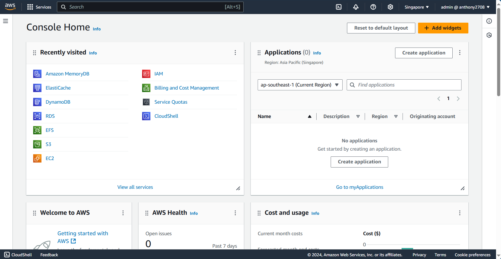

import { LinkCard, Steps } from '@astrojs/starlight/components';

_Xin chào. Đây là ngày thứ 30 của hành trình. Một tháng trôi qua, à không, phải là hai tháng mới đúng,
chúng ta đã tìm hiểu được rất nhiều những chủ đề thú vị về DevOps. Bây giờ sẽ là những điểm đến cuối
cùng của giai đoạn 5. Hôm nay chúng ta sẽ khám phá mô hình mạng trên AWS cũng như cách chúng ta quản 
lý hạ tầng với nền tảng này._

**_Hãy sẵn sàng để cùng lạc vào mê cung nào!_** 🏞

## Đám mây ảo riêng tư - VPC

_Đây là điểm đến đầu tiên của AWS khi nhắc đến Cloud. VPC có những điểm đáng chú ý sau đây._

<Steps>

1. _VPC là một cấu trúc được tạo mặc định trong AWS, với các **mạng con ảo (subnet)** khác nhau._
2. _Mỗi mạng con ảo trong VPC có một hoặc **nhiều dải địa chỉ IP** được gán vào và có hỗ trợ
**IPv4/IPv6**._ 
3. _Mỗi mạng con ảo trong VPC sẽ chỉ gắn với **một vùng khả dụng**._
4. _Mỗi mạng con ảo đều có **ACL - Danh sách kiểm soát truy cập** để hỗ trợ việc cấp quyền truy
câp mạng cho máy ảo._
5. _Mỗi mạng con ảo có thể nằm ở chế độ **riêng tư** hoặc **công cộng**. Ở chế độ **công cộng**, 
các thiết bị trong mạng con có thể giao tiếp với bên ngoài, ngược lại cần phải dùng 
**NAT Gateway**._
6. _Mỗi máy ảo phải đặt trong VPC, mỗi VPC nằm trong **một khu vực nhất định**._
7. _Các máy ảo cùng mạng **có thể giao tiếp** với nhau._
8. _VPC ở AWS **không có NAT Gateway mặc định** (tức là cổng giao tiếp giữa mạng riêng và mạng 
công cộng). Để sử dụng thì việc đầu tiên phải làm đó là **có rất nhiều tiền**._

</Steps>

_Ngoài ra AWS cũng hỗ trợ **VPC Peering** - đồng nghĩa với việc kết nối giữa các thiết bị ở 
các VPC khác nhau cũng trở nên đơn giản và dễ dàng hơn._

## Nhóm bảo mật - Security Group

_Cơ chế nhóm bảo mật của AWS đơn giản khá giống như **tường lửa** của máy tính, ngăn chặn 
hoặc cho phép truy cập thông qua địa chỉ hoặc cổng nào đó. Mỗi nhóm bảo mật xác định 
**hai chiều truy cập** cho VPC._

_Dưới đây là một bảng thông tin quen thuộc, một nhóm bảo mật thực thụ trong AWS._

### Ví dụ về Nhóm bảo mật

_Đây là ví dụ điển hình, tất nhiên trên thực tế, AWS cũng hỗ trợ chúng ta trong việc tạo
nhóm theo từng dịch vụ như **Web, Cơ sở dữ liệu**, v.v..._

_Hai nhóm bảo mật dưới đây nằm trên **cùng một VPC**._

#### Nhóm bảo mật thứ nhất - Group A

**_Nhóm này nằm ở mạng con thứ nhất._**

##### Chiều vào (Inbound)

|      **Nguồn**       | **Giao thức** | **Cổng** |
|:--------------------:|:-------------:|:--------:|
| **192.168.100.0/28** |      TCP      |    22    |
|    **10.0.0.0/24**   |     HTTPS     |   443    |

##### Chiều ra (Outbound)

|    **Đích**     | **Giao thức** | **Cổng** |
|:---------------:|:-------------:|:--------:|
|  **0.0.0.0/0**  |     Tất cả    |  Tất cả  |

#### Nhóm bảo mật thứ hai - Group B

**_Nhóm này nằm ở mạng con thứ hai._**

##### Chiều vào (Inbound)

|      **Nguồn**       | **Giao thức** | **Cổng** |
|:--------------------:|:-------------:|:--------:|
| **192.168.100.0/28** |      TCP      |    22    |
|    **10.2.0.0/24**   |    Tất cả     |  Tất cả  |

##### Chiều ra (Outbound)

|    **Đích**     | **Giao thức** | **Cổng** |
|:---------------:|:-------------:|:--------:|
|  **0.0.0.0/0**  |     Tất cả    |  Tất cả  |

## Cân bằng tải - LB

_Cái tên nói lên tất cả, cân bằng tải là một việc chúng ta **chia lưu lượng truy cập** vào nhiều máy
ảo khác nhau thay vì chỉ dồn lên một máy gây quá tải dẫn đến sập hệ thống. Với AWS có ba giải 
pháp nằm trong cùng một cái tên: **ELB - Cân bằng tải linh động**._

<Steps>

1. _**Cân bằng tải Ứng dụng - Tầng 7 của mô hình OSI**. Giảm tải SSL, định tuyến dựa trên cookie và
nội dung dựa trên đường dẫn_
2. _**Cân bằng tải Mạng - Tầng 4 của mô hình OSI**. Phân phối và chuyển tiếp cổng dựa trên hàm băm._
3. _**Cân bằng tải Cổng** - Một dạng thức giúp kiểm tra "**sức khỏe**" của máy chủ. 
**Tầng 4 của mô hình OSI**, tuy nhiên cách hoạt động khác so với Cân bằng tải Mạng._

</Steps>

## Công cụ quản lý

_Dưới đây là một số công cụ làm việc hữu dụng với AWS mà mọi người cần phải lưu tâm._

### Cửa sổ Quản trị (AWS Management Console)

_Dưới dạng Web, đây là một dạng thức giúp chúng ta kiểm soát mọi thứ trên AWS một cách đơn giản và tiện
lợi nhất._

### AWS CLI - Giao diện dòng lệnh

_Một cách tương tác nhanh chóng và dễ dàng với các dịch vụ của AWS - thực chất việc tương tác với AWS CLI
cũng tương tự việc ta g**ọi đến API xử lý dịch vụ** của AWS vậy._

_Để sử dụng, ta cần phải tải bộ cài về máy, truy cập tại **[đây](https://aws.amazon.com/vi/cli/)** để biết thêm 
thông tin chi tiết - nếu cần hướng dẫn xin liên hệ ngay cho mình._

### Visual Studio Code 

_IDE - Không cần nói cũng biết nó là gì, đó là nơi mà bài viết này được viết lên và đăng tải trên website
của series này._

### AWS Cloud9

_Không biết mọi người có nghe câu **"Vui như trên chín tầng mây"** chưa nhỉ? Trong tiếng Anh có một câu tương tự
là **"On the cloud nine"**, mà Cloud9 thật trùng hợp lại là chiếc IDE ngay trên giao diện Web của AWS. Ngoài ra,
nó còn tích hợp với **CloudShell**, cũng chính là CLI của AWS ngay trên web luôn._

:::caution[THÔNG BÁO]

_Từ ngày 25/07/2024, AWS khai tử AWS Cloud9 và chỉ sử dụng **CloudShell** hoặc **IDE Toolkit** cho các nhà phát 
triển, chi tiết mọi người có thể xem tại 
**[đây](https://aws.amazon.com/vi/blogs/devops/how-to-migrate-from-aws-cloud9-to-aws-ide-toolkits-or-aws-cloudshell/)**_

:::

**_Đó là những dấu ấn của ngày 30, và hành trình sẽ được tiếp tục với ngày 31 ngay sau đây._**

## Tài liệu tham khảo 📚

_Mời mọi người chuyển sang trang này để theo dõi tất cả tài liệu liên quan trong giai đoạn 5, 
để giúp bản thân có được những tài liệu hữu ích về Điện toán đám mây trong làm việc với DevOps._

<LinkCard
  title="Ngày 30 - Tham khảo"
  href="../../../reference/cloud/day26"
/>

_Hẹn gặp mọi người ở những ngày tiếp theo._ 🚀