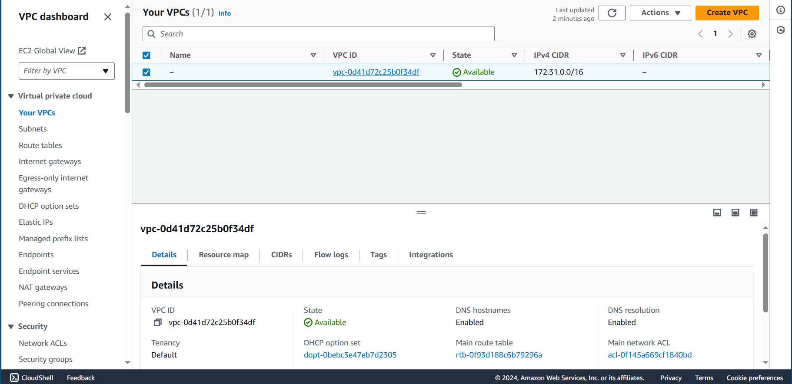
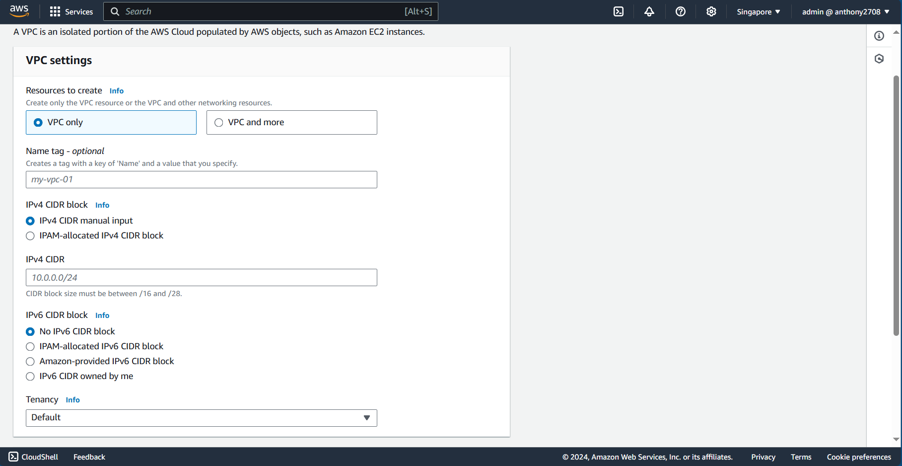
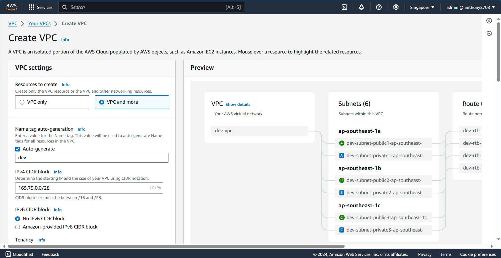
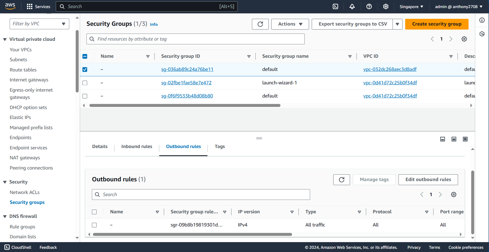
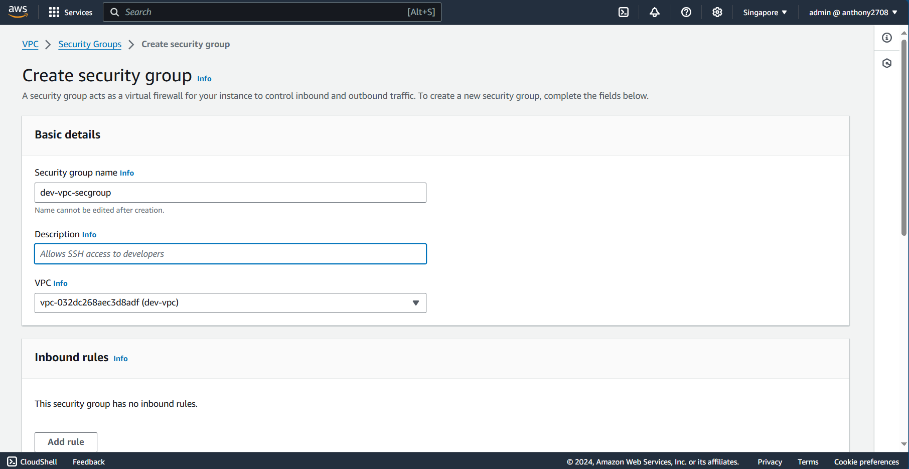
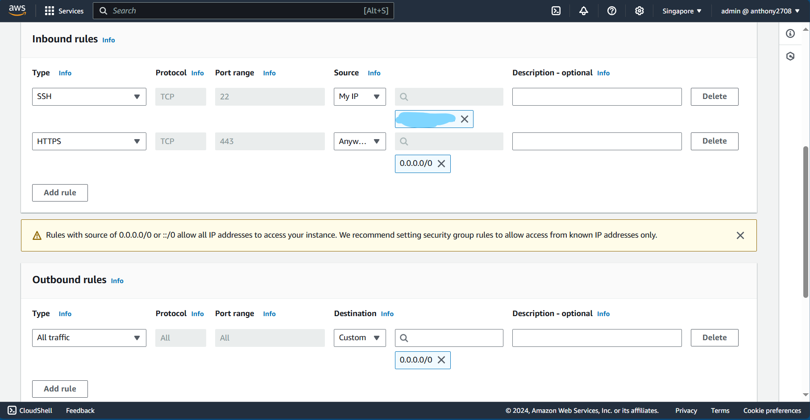
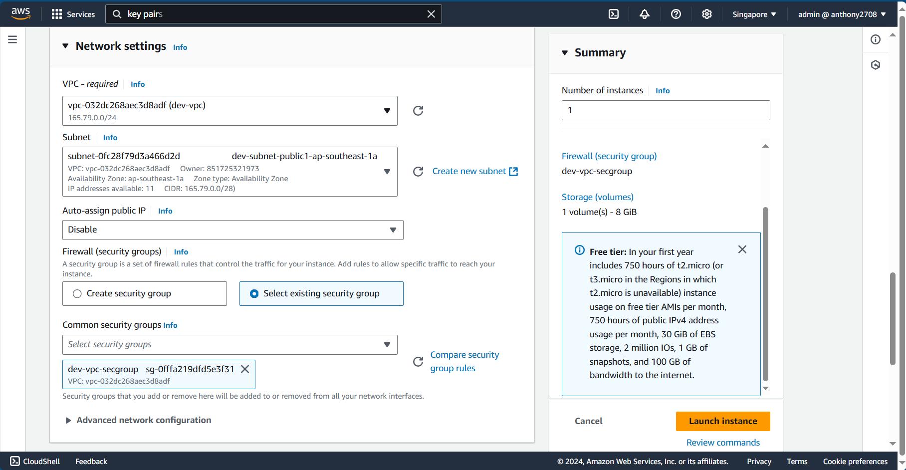
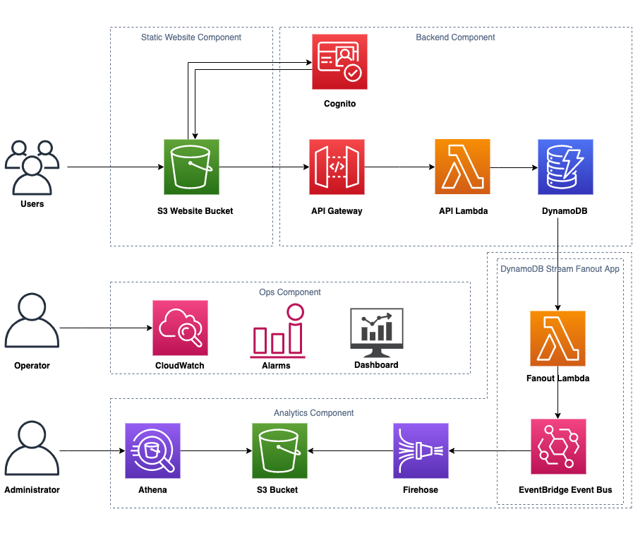
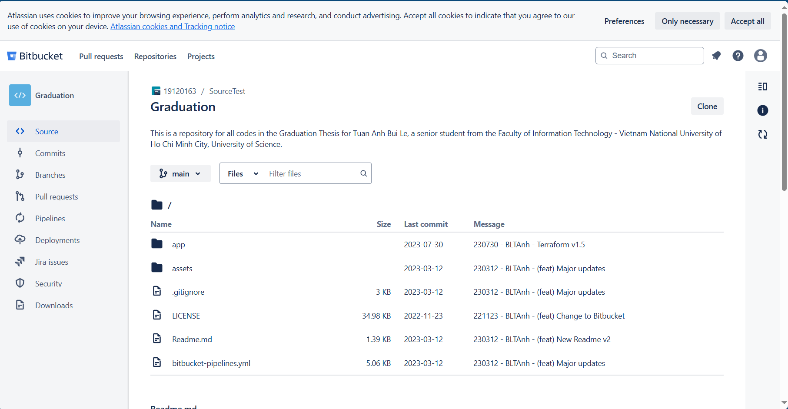

import { LinkCard, Steps } from '@astrojs/starlight/components';

_Xin chào. Đây là ngày thứ 31 của hành trình. Cuối cùng thì mình cũng có thời gian để quay lại
với đam mê viết lách của mình. Đây là điểm đến cuối cùng của Giai đoạn 5, và hãy cùng mình **xách
ba lô lên và đi vào thực hành với AWS thôi!**_ 🎒

## Khởi tạo Đám mây riêng tư ảo

_Vào Cửa sổ quản lý, gõ vào thanh tìm kiếm VPC và chọn dịch vụ VPC. Xuất hiện giao diện như dưới,
chọn **Tạo VPC** (Create VPC)._

  

_Ở giao diện dưới đây, hãy nhập các thông tin tương ứng theo ý muốn của mình._

_Đối với bài Lab này, ta sẽ không cần tạo IPv6, do đó, bỏ trống ở mục này. Nếu chuyển sang mục
**VPC and More**, xuất hiện giao diện như hình sau. Hãy thay đổi cấu hình bổ sung nếu cần. Sau 
đó chọn **Tạo**._

## Khởi tạo Nhóm bảo mật

_Tiếp theo, sau khi quay lại giao diện chính của VPC, ở thanh điều hướng bên trái, mục 
**Bảo mật (Security)**, chọn **Nhóm bảo mật**. Tại đây ta sẽ tạo mới một nhóm bảo mật._

_Giao diện tạo thường sẽ có hai chiều tạo với các quy luật khác nhau để ta cấu hình. Lưu ý, ở mục
VPC hãy chọn VPC mà ta vừa mới tạo xong._

_Ở mục quy tắc, hãy chọn các quy tắc cho **cả hai chiều** vào và ra khỏi VPC tương ứng với yêu cầu 
của chúng ta, ví dụ như hình dưới, sau đó bấm nút **Tạo**._

## Khởi tạo máy chủ ảo

_Việc tạo máy ảo cũng tương tự là quay về mục EC2, bấm nút **Tạo**. Điền đầy đủ thông tin và 
**tạo cặp khóa** để kết nối vào hệ thống. Ở mục **Cài đặt mạng**, chọn VPC đã tạo và cập nhật
một mạng con thuộc nhóm **Công cộng**._

:::note[Lưu ý]

**_Một mạng con thuộc nhóm Riêng tư không cho phép truy cập từ bên ngoài vào._**

:::

## Khởi tạo ứng dụng web phi máy chủ

_Mọi người có thể tham khảo chiếc kho lưu trữ **[này](https://bitbucket.org/19120163/graduation/)** 
để hiểu thêm về quy trình xây dựng một ứng dụng web phi máy chủ trên nền tảng AWS như thế nào._

_Để mọi người dễ hình dung: Một **ứng dụng web phi máy chủ** sẽ là một ứng dụng mà ở đó mã nguồn 
sau khi dựng xong được lưu thành các trang có định dạng HTML trên một kho lưu trữ đám mây 
(ở đây là **S3**), và được sao chép trên hệ thống **CDN (máy chủ)** khắp thế giới. Ứng dụng này 
sẽ bao gồm đầy đủ các phần như **giao diện, xử lý và cơ sở dữ liệu hoàn chỉnh**._

:::danger

- **_Không tái sử dụng ứng dụng vì kho đã lỗi thời và không còn hoạt động như ban đầu._** 
- _Kho lưu trữ chỉ có tác dụng tham khảo, vì có nhiều thành phần khác kèm theo._

:::

_Đó là một số bài thực hành đơn giản mà mọi người có thể dễ dàng theo dõi và thực hiện. Nếu gặp bất
kỳ khó khăn gì, xin đừng ngần ngại liên hệ với mình để nhận được sự hỗ trợ tốt nhất._

**_Hành trình thứ năm về Điện toán đám mây đã khép lại tại đây. Xin trân trọng cảm ơn._** ✅

## Tài liệu tham khảo 📚

_Mời mọi người chuyển sang trang này để theo dõi tất cả tài liệu liên quan trong giai đoạn 5, 
để giúp bản thân có được những tài liệu hữu ích về Điện toán đám mây trong làm việc với DevOps._

<LinkCard
  title="Ngày 31 - Tham khảo"
  href="../../../reference/cloud/day26"
/>

_Hẹn gặp mọi người ở những ngày tiếp theo, nơi mà chúng ta sẽ đến với **Git và GitHub - hai công 
cụ quản lý phiên bản mã nguồn** giúp đưa website này vận hành tốt nhất._ 🚀