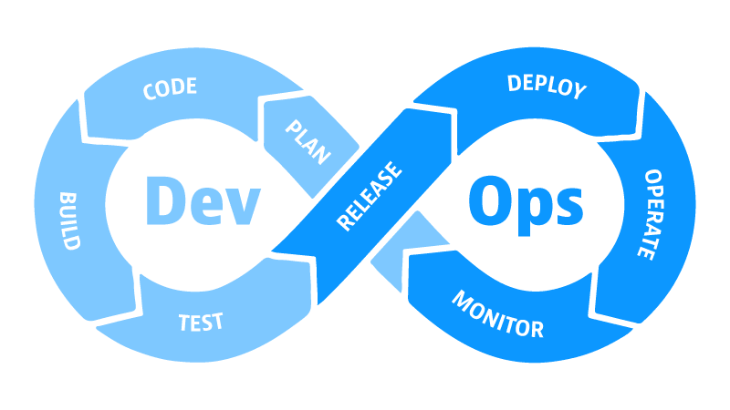

import { Steps } from '@astrojs/starlight/components';

_Xin chào mọi người, mình là Tuấn Anh. Thực ra sẽ là thiếu sót nếu như không nói rõ về những gì đang diễn ra ở đây - rằng từ ngày 01/06 sẽ có thêm 1 điểm hẹn hoàn toàn mới, chính thức lên sóng cho mọi người. Đó chính là hành trình **90 ngày cùng DevOps**._

> **Nguồn**: [Dynatrace](https://www.dynatrace.com/news/blog/what-is-devops/)

## Tại sao lại là 90 ngày?

_Mình biết rằng, DevOps đang là xu hướng của rất nhiều công ty công nghệ, nhằm mang đến trải nghiệm và hiệu quả tốt hơn cho 
quá trình xây dựng và phát triển phần mềm, đem đến những sản phẩm tối ưu nhất đến người dùng. Lĩnh hội DevOps, không phải là 
một hành trình dễ dàng, bởi nó đòi hỏi sự kiên trì, nỗ lực và thời gian. Vì vậy, mình quyết định chọn **90 ngày**, như một 
thời gian đủ dài để mình có thể tìm hiểu, học hỏi và áp dụng những kiến thức, kỹ năng mà mình học được vào thực tế cũng như 
chia sẻ thiết thực đến tất cả mọi người._

## Vậy thật sự hành trình này sẽ diễn ra đến khi nào?

_Trước mắt, nó sẽ diễn ra từ **01/06 - 30/09/2024**. Sau đó, tùy thuộc vào phản hồi của mọi người mà hành trình này có thể được
 tiếp tục hay không._

## Đâu là nơi khởi phát ý tưởng này?

_Mình biết được sự có mặt của chiếc kho lưu trữ [này](https://github.com/MichaelCade/90DaysOfDevOps), nhưng có vẻ nó vẫn 
chưa được hoàn thiện một cách tuyệt đối để mọi người tham khảo, do đó, mình sẽ gom lại tất cả mọi bài viết của các năm, 
khởi đầu từ năm 2022 dể Việt hóa lại cho phù hợp với nhiều đối tượng độc giả hơn._

## Điểm nhấn của hành trình này?

_Hành trình này sẽ được cập nhật điểm đến liên tục tại bài viết ngày 0 này. Dưới đây là những gì sẽ xuất hiện trong
 hành trình:_

<Steps>

1. DevOps là gì? Tại sao lại phải DevOps?
2. Ngôn ngữ lập trình
3. Kiến thức về hệ điều hành Linux
4. Kiến thức về Mạng máy tính
5. Kiến thức về Điện toán đám mây
6. Git và cách sử dụng
7. Containers (Ảo hóa)
8. Kubernetes - K8s
9. Cơ sở hạ tầng dưới dạng mã nguồn - Infrastructure as Code
10. Tự động hóa quản trị cấu hình 
11. CI/CD
12. Giám sát - Quản lý dữ liệu nhật trình và trực quan hóa dữ liệu (Logs)
13. Lưu trữ và bảo vệ dữ liệu

</Steps>

_Tất nhiên, đây là phiên bản chưa đầy đủ của cả một hành trình rất dài về DevOps. Do vậy, mình vẫn sẽ không ngừng nâng cấp 
nhằm mang đến những nguồn tư liệu mới nhất cho mọi người._

## Kết

_Hy vọng mọi người sẽ cảm thấy hữu ích khi tham gia hành trình này. Mình sẽ cố gắng hết sức để mang đến những kiến thức, 
kỹ năng và trải nghiệm thực tế nhất cho mọi người. Cảm ơn mọi người đã đọc đến đây. 
Hẹn gặp lại mọi người ở những bài viết tiếp theo._