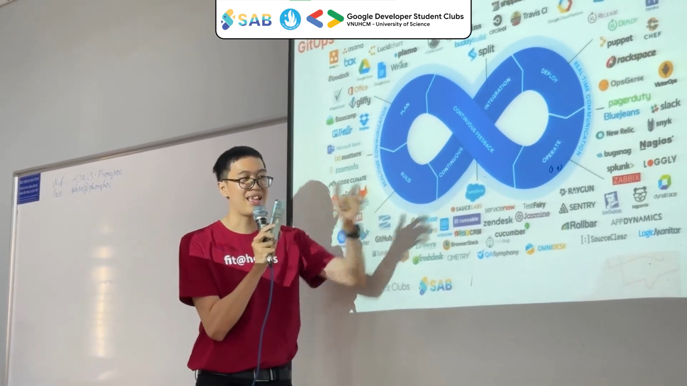
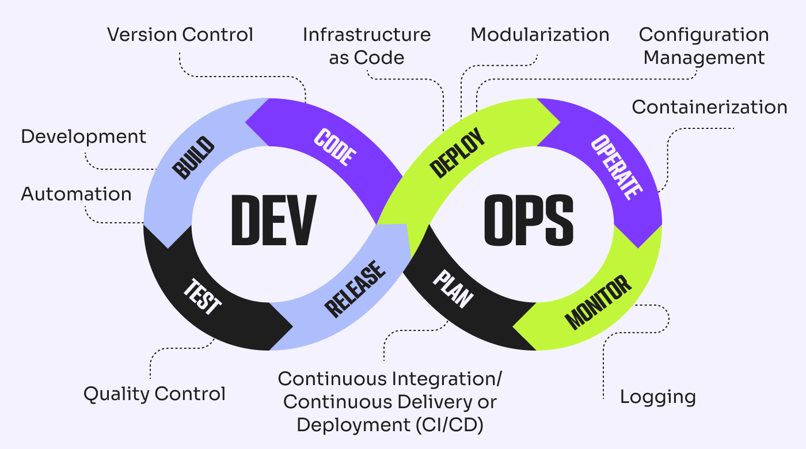
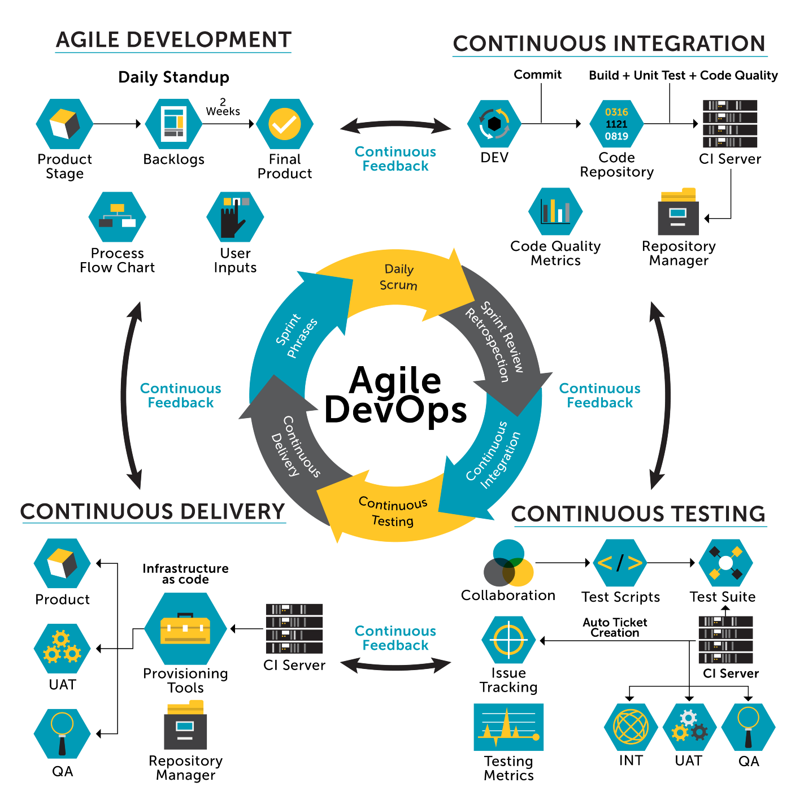

import { LinkCard, Steps } from '@astrojs/starlight/components';

_Hành trình bắt đầu với ngày đầu tiên, và đây là câu chuyện của riêng mình..._

_Quay trở về những ngày sinh viên, khi mà mình vẫn rơi vào vòng xoáy chọn chuyên ngành. Chẳng biết bằng một thế lực nào
(**chắc là do lo sợ điểm không đủ để vào Kỹ thuật phần mềm**) mà mình đã chọn chuyên ngành **Mạng máy tính & Truyền thông**. 
Từ đây, một hành trình mới, cơ hội mới đã bắt đầu. Cũng từ lúc đó, mình chợt nhận ra, thế giới DevOps này thật sự **quá 
rộng lớn**. Nó không chỉ là DevOps. Nó là **ảo hóa**, là **dịch vụ mạng**, là **điện toán đám mây**... Nó khiến mình hăng say,
cộng với tính tò mò khó bỏ của mình (**này nhiều người sẽ báo tánh kì**)_ 🤣 _, khiến mình muốn du ngoạn tới **tận cùng địa đàng... 
à nhầm, tận cùng ngõ hẻm** của thế giới này để biết thêm về những miền xa thẳm chưa được khám phá._

_Mình cũng từng trở thành một diễn giả trong một sự kiện của trường Đại học và chia sẻ rất nhiều về DevOps. Mình hiểu rằng,
đã đến lúc mình ghi chép lại những gì đã tìm hiểu và chia sẻ nó với mọi người._

> **Nguồn**: GDSC-HCMUS/SAB in HCMUS

<LinkCard
  title="Thế bạn đã sẵn sàng học DevOps chưa?"
  href="https://www.veeam.com/blog/learn-devops-comprehensive-beginner-guide.html"
/>

## Giong buồm, đón gió, ra khơi 🌊

**_Sau khi đọc xong bài viết phía trên, chắc hẳn bạn đã có một cái nhìn tổng quan về DevOps rồi đúng không?_**

_Dẫu rằng bản thân không phải là một chuyên gia DevOps, trong 90 ngày tới, mình sẽ ghi lại những kiến thức mình đã học và
trải nghiệm được trong suốt thời gian qua, và hy vọng rằng bạn, với tư cách là một độc giả, cũng sẽ giúp mình **đau khổ...
à nhầm, đau đầu** với những góp ý, câu hỏi để giúp mình hoàn thiện hơn kho tài liệu hữu ích này._

*Chuyến hành trình 90 ngày sẽ chia thành **13 điểm đến chính**, mỗi nơi sẽ có một câu chuyện riêng, để kể cho mọi người. Với vai
trò của một **hướng dẫn viên**, mình cũng sẽ cung cấp một tấm bản đồ trực quan hơn, để mọi người hiểu được mình đang ở đâu, và 
cần phải làm gì tiếp theo để không rơi vào trạng thái "**vì thiếu ngủ nên bị lạc**". Tấm bản đồ này lớn lắm 
(**vì nó bao quát nhiều hơn 13 điểm đến chính**), nên mời mọi người bấm vào nút **dưới đây** để xem cho nó rõ nhé.*

<LinkCard
  title="DevOps Roadmap - Lộ trình DevOps"
  href="https://roadmap.sh/devops"
/>

## Bước chân đầu tiên 👣

_Hãy bắt đầu với câu hỏi đầu tiên: **DevOps là gì?**_

_Có rất nhiều bài viết, video có thể giúp trả lời câu hỏi này, nhưng để bắt đầu hành trình một cách dễ dàng nhất, chúng ta 
sẽ nhắc đến những điều quan trọng sau._

<Steps>

1. _**DevOps không phải là một công cụ.** Bạn không thể mua nó từ cửa hàng, cài đặt và sử dụng ngay lập tức. Nó cũng chẳng phải 
là một kho lưu trữ mã nguồn mở để bạn có thể phát triển cả._
2. _**DevOps không phải là một ngôn ngữ lập trình**, cũng chẳng phải thứ **bùa phép tà đạo** nào ở đây cả._
3. _DevOps là một **phương pháp làm việc**, một **triết lý** giúp cho các nhóm phát triển phần mềm và quản trị hệ thống có thể
làm việc hiệu quả hơn, nhanh hơn và linh hoạt hơn._

</Steps>

_Khoan đã... **Thế nếu bạn không phải dân IT, không phải là một lập trình viên, thì sao? Có cần phải học DevOps không?** Gượm lại
đã, ở lại đây nghe **tâm tình yêu thương** vài phút cũng được mà... Vì DevOps mang đến sự **kết đôi hoàn hảo giữa phát triển và 
vận hành sản phẩm**, điều đó cũng có nghĩa là, dù bạn ở nhánh nào của chiếc **vòng tròn vô cực đầy vô tri** đã từng đề cập ở 
ngày 0 - **Lập trình viên, Chuyên viên vận hành, Kiểm thử viên** đều có thể hưởng lợi từ việc hiểu rõ hơn về DevOps ấy mà..._ 🤗

> **Nguồn**: [The CTO Club](https://thectoclub.com/news/devops-best-practices/)

_DevOps là một tập hợp các thực hành giúp đạt được mục tiêu: **Cắt giảm thời gian từ khi lên ý tưởng đến lúc ra mắt phiên bản vận
hành của ứng dụng cho người dùng cuối**, dù là khách hàng ngoài hay nội bộ công ty._

_Một chủ đề khác sẽ được bàn thảo trong tuần đầu tiên là: **Phương pháp Agile**._

> **Nguồn**: [Agile First](https://agilefirst.io/agile-devops/)

_Cùng với DevOps, Agile được áp dụng rộng rãi giúp ứng dụng được đưa ra vận hành liên tục._

_Điểm mấu chốt ở đây chính là về **mặt tư duy**: Văn hóa DevOps là **thu hẹp, chia nhỏ quy trình** phát triển phần mềm có thể 
kéo dài nhiều năm thành các bản phát hành **nhỏ hơn và thường xuyên hơn**. Một điểm quan trọng khác cần hiểu ở đây là 
trách nhiệm của một kỹ sư DevOps trong việc **thu hẹp khoảng cách** giữa các Team, bao gồm: **Phát triển, Vận hành, Kiểm định**._

_Như vậy có thể hiểu rằng: Các giai đoạn Phát triển, Vận hành, Kiểm định, **dưới góc độ DevOps, đều có liên quan đến 
các thành viên của Team DevOps**._

_Điều cuối cùng cần được chú tâm: Quy trình phát triển phần mềm cần, nên và luôn được **tự động hóa**. Điều này giúp cho toàn bộ
các bước thực hiện được diễn ra một cách **nhanh chóng và hiệu quả nhất**._

## Tài liệu tham khảo 📚

_Mời mọi người chuyển sang trang này để theo dõi tất cả tài liệu liên quan đến DevOps trong ngày đầu tiên, để giúp bản thân
có được những kiến thức cơ bản nhất về DevOps._

<LinkCard
  title="Ngày 1 - Tham khảo"
  href="../../reference/day1"
/>

_Hẹn gặp mọi người ở những ngày tiếp theo!_ 🚀