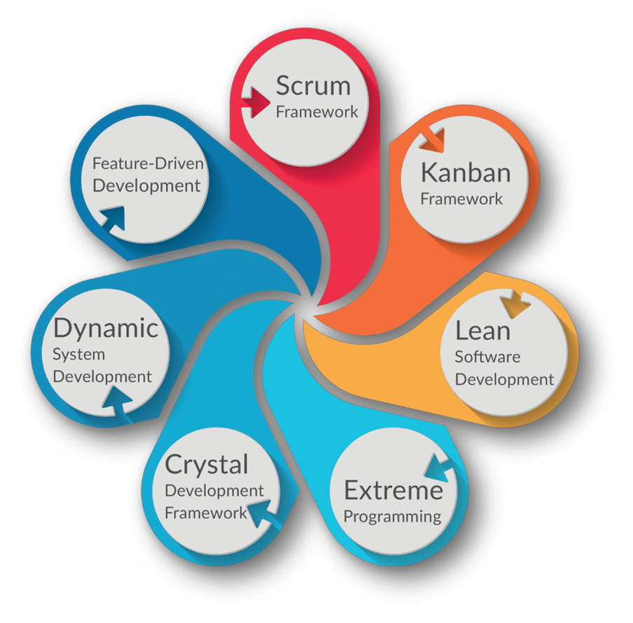

import { LinkCard, Steps } from '@astrojs/starlight/components';

_Xin chào mọi người, cuối cùng thì sau một khoảng thời gian khắc phục sự cố liên quan đến thiết bị thì chặng hành trình của
chúng ta lại tiếp tục với ngày thứ tư. Lần này chúng ta sẽ ghé thăm một điểm đến **hoàn toàn mới**, và cùng nhau chiêm nghiệm, 
so sánh sự khác biệt giữa hai trường phái khác nhau: **DevOps** và **Agile**. Thế rốt cuộc thì Agile nó khác DevOps chỗ nào, 
mà tại sao mình lại phải đi tham quan nó chứ? **Phải chăng có một điều bí ẩn nào đang chờ đón mọi người?**_

**_Nếu sự tò mò này đã lên đến đỉnh điểm, vậy thì sẵn sàng lên đường thôi!_** 🚙

## Ấn tượng ban đầu 🛤

<Steps>

1. _**Agile (hay Phương pháp Agile)**: Cách tiếp cận tập trung vào việc cung cấp các **tính năng nhỏ và nhanh hơn** 
thay vì phát hành một bản vá lớn của ứng dụng. Phần mềm được phát triển trong nhiều giai đoạn (iteration), các phiên bản 
mới sẽ được ra mắt trong các bản cập nhật hàng tuần hoặc hàng tháng. Mục tiêu cuối cùng của Agile là **tối ưu trải nghiệm** 
của người dùng cuối._
2. _**DevOps**: Các phương pháp phát triển và phân phối phần mềm dựa trên sự **hợp tác chặt chẽ** giữa nhóm phát triển 
phần mềm và nhóm vận hành. Lợi ích chính của DevOps là **đơn giản hoá quy trình** phát triển và **giảm thiểu thông tin 
sai lệch** giữa các bộ phận._

</Steps>

## Phi thường làm nên khác biệt 🏕

_Để nói đến sự khác biệt giữa hai trường phái này, có lẽ sẽ là **đối tượng** mà hai nơi này hướng đến. Tuy vậy, giữa hai nơi 
này có một mối liên kết mà chỉ có khi kết hợp lại với nhau mới làm nên thành công cho một dự án du lịch hoàn hảo. 
Trong giới hạn của phần hai này, xin phép nêu ra những điểm **khác nhau trước nhất** giữa cả hai._

### "Kênh quốc gia" và "Kênh khu vực" 📺

_Thuật ngữ này được sử dụng trong phát thanh/truyền hình để nói đến một hệ thống gồm các kênh **không chia theo vùng** 
(VTV1, VTV2, VTV3) và kênh chuyên **phục vụ theo vùng** (VTV8, VTV9, VTV Cần Thơ). Nếu áp dụng cùng một hệ quy chiếu như 
truyền hình thì **Agile thuộc nhóm Quốc gia** (vì phục vụ trực tiếp từ nhóm phát triển đến khách hàng), trong khi đó **DevOps 
lại thuộc nhóm Khu vực điển hình** (phục vụ giữa nhóm phát triển và nhóm vận hành)._

### Bộ phận công tác 🏢

_Agile tập trung vào **nhánh trái** của Vòng lặp DevOps (tức nhóm phát triển, quản lý dự án). Trong khi đó, DevOps lại đứng 
**ở giữa** vòng lặp, vì gần như **tất cả mọi giai đoạn** của dự án đều có DevOps tham gia cùng. DevOps có thể được xem là 
một phần của nhóm Agile._

### Bộ khung làm việc 📃

_Agile có nhiều bộ khung khác nhau để đạt sự linh hoạt và minh bạch, với một đường đi được vạch sẵn như hình dưới._

> **Nguồn**: [IWConnect](https://iwconnect.com/are-you-ready-to-use-kanban/)

_DevOps lại **không có** bất kỳ bộ khung nào cho quá trình phát triển. Cơ sở hạ tầng dưới dạng mã nguồn (IaC), 
giám sát và tự khắc phục lỗi, tự động hóa kiểm thử ứng dụng chỉ là các **phương pháp** chứ không được gọi là **bộ khung**, 
và các phương pháp này hỗ trợ cộng tác trong việc phát triển phần mềm._

### Nhận xét và phản hồi ✅

### Phạm vi công việc 📖

### "Kịch bản phát sóng" 📓

### "Công cụ truyền dẫn" 🖥

## Combo hoàn hảo cho một ngày diệu kỳ 🗃

_Kết hợp Agile và DevOps trong một chuyến hành trình duy nhất sẽ mang lại những lợi ích to lớn như:_

- _Lộ trình được **quản lý linh hoạt** với các **công cụ mạnh mẽ**._
- _Phương pháp Agile giúp các nhóm DevOps giao tiếp, trao đổi về các **nhiệm vụ ưu tiên** một cách hiệu quả hơn._
- _Tối ưu chi phí phát sinh từ quá trình tự động hóa, giúp hành trình trở nên nhanh chóng hơn và tăng tỷ lệ "**tái thực
hiện chuyến đi**" hơn._
- _Quá trình giao tiếp, hợp tác của các thành viên trong nhóm Agile trở nên tốt hơn, tăng động lực cho nhóm và giúp giảm
tỷ lệ "**trốn về nước**"._
- _Kết quả là sản phẩm ra mắt người dùng cuối có **chất lượng và trải nghiệm tốt hơn**._

_Agile cho bạn quay lại các quá trình phát triển sản phẩm trước đó để sửa lỗi và tránh việc mắc quá nhiều 
**sai sót kỹ thuật (technical debt)**. Để ghé thăm Agile và DevOps cùng lúc, chúng ta cần lên trước một bản 
kế hoạch như sau:_

<Steps>
1. _Tích hợp các nhóm phát triển và vận hành lại thành một nhóm, tức là "**Non sông liền một dải**".
Đây là cách người ta gọi là "**yêu nước trong từng hành động nhỏ nhất**"_ 💖
2. _Các thành viên trong nhóm chung cần có **tinh thần kiến tạo, xây dựng, sẵn sàng thảo luận và cùng đồng hành** trong 
tất cả các vấn đề liên quan tới phát triển cũng như vận hành sản phẩm._
3. _Thay đổi cách tiếp cận với các **điểm dọc đường (sprints)**, đánh giá các nhiệm vụ DevOps với **mức độ ưu tiên 
tương đương** với các nhiệm vụ phát triển phần mềm._ 
4. _Nhóm Kiểm định chất lượng cần có mặt trong **tất cả các quy trình phát triển**._
5. _Lựa chọn các công cụ công tác phù hợp, tránh tình trạng "**lấy râu ông này, cắm cằm bà kia**"_
6. _Tự động hoá mọi thứ có thể. Hãy thù ghét những ai thích làm bằng tay **không vì lí do gì cả**_ 🤣
7. _Đo lường và kiểm soát các bản cập nhật mới bằng **những cách làm dễ hiểu** và **đạt sự thống nhất** giữa các thành viên._
</Steps>

_Đây là những gì mà các kỹ sư cần phải làm. Còn bạn, **bạn nghĩ sao về "Kế hoạch 7 bước" này?** Hãy chia sẻ cùng mình nhé._

:::note[Lưu ý]

_Nếu bạn có bất kỳ ý kiến nào liên quan đến bản kế hoạch này hay thậm chí là các bài viết của series, vui lòng liên hệ 
qua các phương thức được chọn ở **góc phải màn hình (đối với bản máy tính)** hoặc **nút điều hướng góc phải 
(đối với bản di động)**._

:::

## Tài liệu tham khảo 📚

_Mời mọi người chuyển sang trang này để theo dõi tất cả tài liệu liên quan đến DevOps trong ngày thứ tư, để giúp bản thân
có được những thông tin về DevOps và Agile._

<LinkCard
  title="Ngày 4 - Tham khảo"
  href="../../../reference/day4"
/>

_Hẹn gặp mọi người ở những ngày tiếp theo!_ 🚀