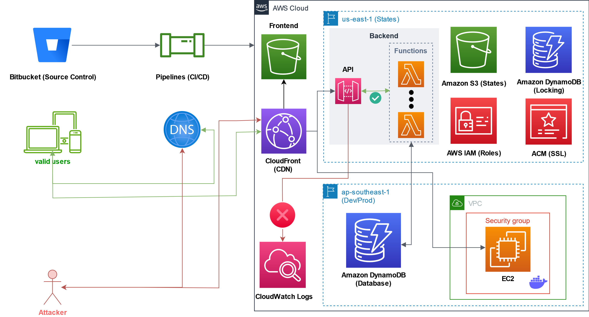
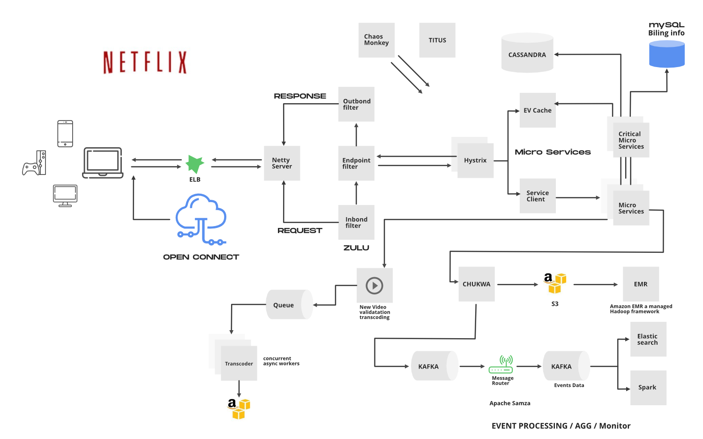

import { LinkCard, Steps } from '@astrojs/starlight/components';

_Xin chào mọi người. Cuối cùng thì chúng ta đã đến với **ngày cuối cùng của giai đoạn 1** rồi. Chúng ta đã tìm hiểu rất nhiều, 
gần như tất tần tật mọi thứ về DevOps, cũng như những khó khăn mà một người làm DevOps gặp phải. Ngày hôm nay, chúng ta sẽ đi
ra thế giới một chút, lắng nghe những câu chuyện có thật về cách các doanh nghiệp lớn áp dụng thành công DevOps vào quá trình
vận hành và phát triển, giúp **tăng tốc độ và cải thiện chất lượng cho sản phẩm**._

**_Nào, hãy sẵn sàng để khởi động chuyến hành trình này thôi!_** ⛵

## Đi chợ "trời" thôi - Chuyện từ Amazon 🛍

_Chúng ta sẽ quay lại năm **2010** - Thời điểm mà Amazon - một tập đoàn đa ngành lớn của Hoa Kỳ quyết định chuyển toàn bộ 
hệ thống từ máy chủ truyền thống sang máy chủ ảo chạy trên **AWS** - một dịch vụ khác do hãng tự sản xuất. Việc chuyển đổi
này giúp tập đoàn tiết kiệm rất nhiều tài nguyên bằng cách **điều chỉnh hạn ngạch máy ảo theo nhiều giai đoạn nhỏ** khác 
nhau. Kết quả của việc này là biến **AWS - Amazon Web Services** trở thành "**gà đẻ trứng vàng**" cho Amazon._

_Một năm sau, vào năm **2011**, Amazon tiến hành áp dụng **CI/CD** (**xem lại [ngày 5](../day5) để hiểu thuật ngữ này**) 
cho phép nhóm Phát triển phần mềm có thể đưa mã nguồn ứng dụng vào vận hành bất kỳ lúc nào, trong thời gian siêu ngắn mà 
theo như ghi nhận trong một video (**sẽ được chia sẻ ở mục Tài liệu tham khảo**), trung bình chỉ có **11.6 giây** 
(11.6 giây là **chưa đến 20% của một phút**)._

_Dưới đây là một mô hình mẫu, sử dụng AWS được mình dựng trong quá trình thực hiện **Khóa luận tốt nghiệp vào năm 2023**._

## Mua hàng xong rồi - Về mở Netflix và ... xem nhé 💽

_Tại sao là **Netflix và xem, chứ không phải thuật ngữ gốc?** Bởi vì thuật ngữ gốc chỉ những người yêu nhau mới hiểu 
(**nó mang yếu tố 18+, mà đây là chiến dịch về công nghệ nên nó không phù hợp để đăng ở chỗ này**)_ 🤣

_Okay, mặc dù Netflix liên tục **dính tai tiếng ở Việt Nam vì vấn đề bản quyền và nội dung chưa phù hợp**, dưới góc độ 
công nghệ, đây vẫn là một trường hợp rất thành công khi áp dụng DevOps._

_Trải nghiệm theo dõi trên Netflix là một thứ trải nghiệm mà người dùng rất ưa chuộng: **Tốc độ cao, chất lượng 4K, 
không giật màn hình và các tính năng được truy cập đơn giản**._

_Nhóm Phát triển tại Netflix đã tự động xây dựng mã nguồn thành các **bản dựng có thể triển khai trực tiếp**, tích hợp 
trở lại vào cơ sở hạ tầng của Netflix bằng các **nền tảng web có thể tùy biến thông minh**._

> **Nguồn**: [GeeksForGeeks](https://www.geeksforgeeks.org/system-design-netflix-a-complete-architecture/)

_Quá trình **giám sát liên tục (Monitor)** cũng được triển khai xuyên suốt nhằm đảm bảo việc định tuyến chính xác trong 
trường hợp thất bại ở việc triển khai phiên bản mới của ứng dụng. Để nắm rõ hơn, mình có cung cấp một video trong phần
 **Tài liệu tham khảo** để mọi người có thể theo dõi và tham khảo thêm._

## Câu chuyện thứ ba - Việt Nam ở đâu?

:::note[Lưu ý]

_Thực ra ở bản gốc vẫn còn đó câu chuyện thứ ba liên quan đến **Etsy**, tuy nhiên để phù hợp hơn với bản Việt hóa, thì 
câu chuyện này **đã được lược bỏ ở đây**._

:::

_Thật sự mà nói, ở Việt Nam mà áp dụng DevOps thì cũng có đó, nhưng mà để có một cái câu chuyện chuyên sâu để kể cho mọi 
người là **rất khó**, bởi đơn giản, không phải tự nhiên mà vị trí DevOps ở Việt Nam lại liên quan nhiều đến yếu tố 
"**đa nhiệm**" và "**chi phí**" đến như vậy - Nếu một cá nhân nào đó làm DevOps ở Việt Nam, họ gần như cần phải biết 
**mọi thứ**, đó là còn chưa kể việc tuyển một kỹ sư DevOps giỏi ở nhiều công ty đồng nghĩa với việc **sa thải hàng loạt 
lập trình viên khác**. Thường cái gì ảnh hưởng đến "**chén cơm**" người ta thì sẽ ngại chia sẻ hơn rất rất nhiều._

_Nhưng mà cũng may, vẫn còn được 1 bài báo nói về DevOps ở FPT Software, trong mục **Tài liệu tham khảo** để gửi đến 
mọi người đọc qua. Bên cạnh đó là rất nhiều câu chuyện thành công khác ở đó, mời quý vị theo dõi._

## Tóm tắt giai đoạn 1

<Steps>

1. _DevOps là sự kết hợp giữa **Phát triển (Development)** và **Vận hành (Operations)** cho phép một nhóm duy nhất quản lý 
toàn bộ vòng đời phát triển ứng dụng._
2. _Trọng tâm và mục đích chính của DevOps là **rút ngắn vòng đời phát triển** trong khi thường xuyên cung cấp các tính năng, 
bản sửa lỗi, chức năng phù hợp và liên quan mật thiết tới các mục tiêu kinh doanh._
3. _DevOps là một cách tiếp cận cho quá trình phát triển phần mềm, qua đó phần mềm có thể được phân phối và phát triển 
một cách **đáng tin cậy và nhanh chóng**._

</Steps>

## Tài liệu tham khảo 📚

_Mời mọi người chuyển sang trang này để theo dõi tất cả tài liệu liên quan trong ngày cuối cùng của giai đoạn 1, 
để giúp bản thân có được những góc nhìn đa chiều và sống động hơn về DevOps ngoài đời thực._

<LinkCard
  title="Ngày 6 - Tham khảo"
  href="../../../reference/devops/day6"
/>

_Hẹn gặp mọi người ở những ngày tiếp theo, nơi mà chúng ta sẽ bắt đầu giai đoạn 2 của chuyến hành trình, với việc học một
ngôn ngữ lập trình hoàn toàn mới._ 🚀