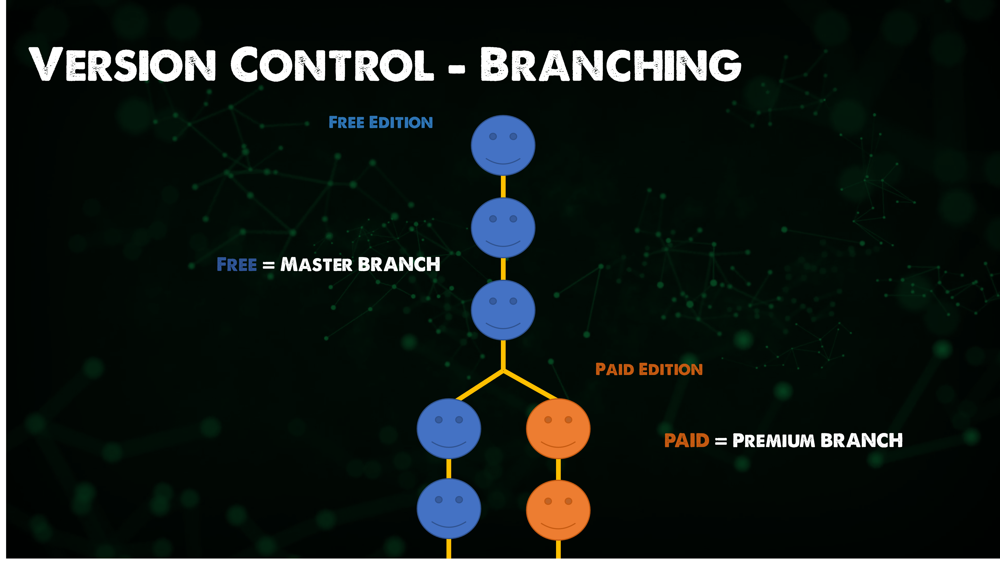
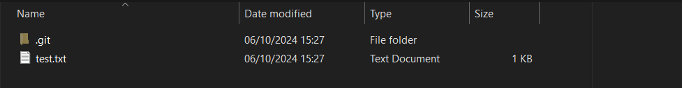
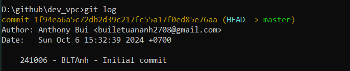
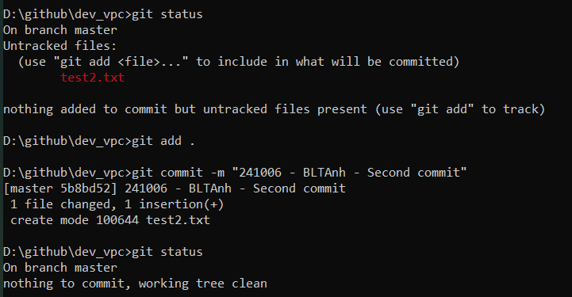
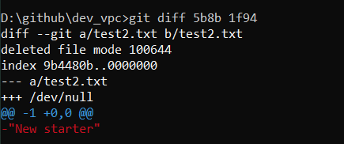

import { LinkCard, Steps, Code } from '@astrojs/starlight/components';

_Phù, chào mừng mọi người đến với chuyến hành trình mới của 90 ngày cùng DevOps, nơi mà ở đó 
chúng ta sẽ khám phá công cụ quản lý phiên bản mã nguồn được tin dùng số 1 trên thế giới -
**Git**. **Đây là chặng thứ sáu và bây giờ, hãy xuất phát thôi!**_ 🚗


> **Nguồn**: [QuoteFancy](https://quotefancy.com/quote/2516375/Deborah-Harkness-In-every-ending-there-is-a-new-beginning)

## Quản lý phiên bản là gì?

_Hãy tưởng tượng, bạn đang ở trong một nhóm phát triển phần mềm. Mã nguồn của phần mềm được nâng
cấp và cập nhật **gần như liên tục**. Câu hỏi đặt ra là làm cách nào để những cập nhật này được **công
khai** đến **tất cả thành viên** trong nhóm phát triển?_

_Bình thường có thể bạn sẽ làm như thế này._

<Steps>
1. _Nén toàn bộ mã nguồn thành tập tin (.zip)_
2. _Gửi qua hệ thống tin nhắn tập tin này đến nhóm trò chuyện_
3. _Từng thành viên giải nén tập tin và theo dõi sự thay đổi_
</Steps>

_Có thể nói đây là cách **cồng kềnh** nhất được sử dụng để thực hiện việc cập nhật mã nguồn. Git 
được sinh ra chính là để **giải quyết** sự cồng kềnh và tiêu hao nguồn lực này._

_Hãy nhìn cái cách mà Git cho chúng ta biết chiếc kho lưu trữ được sử dụng cho 
**90 ngày cùng DevOps** đã có những thay đổi gì._


:::note

**_Quản lý phiên bản mã nguồn không đồng nghĩa với sao lưu dữ liệu mã nguồn._**

:::

_Chính nhờ Git mà những thứ đại loại như phân quyền người dùng được thực hiện một cách dễ dàng và
tiện lợi hơn. Lấy ví dụ như một **ứng dụng freemium** (dạng như FPT Play hay YouTube chẳng hạn), có
những tính năng bổ sung mà **chỉ người dùng trả phí** mới được sử dụng. Ta sẽ **phân nhánh** nhóm tính
năng này riêng biệt với **nhóm tính năng miễn phí**._



_Một điều đáng lưu tâm là các tính năng miễn phí tất nhiên người dùng trả phí sẽ cũng được sử dụng như 
bình thường. Điều này gây phát sinh ra một việc có tên gọi **Nhập nhánh (Merge)**._


_Nhập nhánh tất nhiên sẽ **không giải quyết** những sai lệch giữa các phiên bản mã nguồn khác nhau do chính
chúng ta tạo nên, tuy nhiên sự xuất hiện của các công cụ quản lý phiên bản giúp chúng ta thấy rõ những 
sai lệch (nếu có) này và **tinh chỉnh** cho phù hợp với một thuật ngữ mang tên: **Luồng sự thật duy nhất**._


## Thực hành với Git

**_Chúng ta bắt đầu bằng những câu lệnh đơn giản như sau._**



```bash title="Starting git in a folder..."

git init # Câu lệnh giúp thực hiện tạo Git trong thư mục xác định
git add . # Đưa tất cả các tập tin trong thư mục vào diện quản lý phiên bản
git commit -m "<your message>" # Commit - Xác nhận quản lý phiên bản
git log # Kiểm tra lịch sử git
git status # Kiểm tra trạng thái Git
git diff # So sánh sự khác nhau giữa hai lần commit nhất định trong Git
git checkout <commit-id> # Nhảy về commit nhất định hoặc nhánh nhất định
git switch - # Hoàn tác thao tác trước đó 
```








:::tip[Tóm tắt]

**_Git có những công dụng sau:_**

- _Theo dõi lịch sử của một dự án phần mềm_
- _Quản lý nhiều phiên bản khác nhau của một dự án phần mềm_
- _Chia sẽ mã nguồn và phối hợp làm việc giữa các thành viên trong các nhóm khác nhau_
- _Quay lui lịch sử, thực hiện các thay đổi khi cần thiết_

:::

_Đó là tất cả những gì cơ bản nhất về Quản lý phiên bản, và chúng ta sẽ còn được thực hành nhiều
hơn ở ngày tiếp theo. **Ngày 32 của hành trình kết thúc tại đây**._ ✅

## Tài liệu tham khảo 📚

_Mời mọi người chuyển sang trang này để theo dõi tất cả tài liệu liên quan trong giai đoạn 6, 
để giúp bản thân có được những tài liệu hữu ích về Quản lý phiên bản trong làm việc với DevOps._

<LinkCard
  title="Ngày 32 - Tham khảo"
  href="../../../reference/git/day32"
/>

_Hẹn gặp mọi người ở những ngày tiếp theo._ 🚀