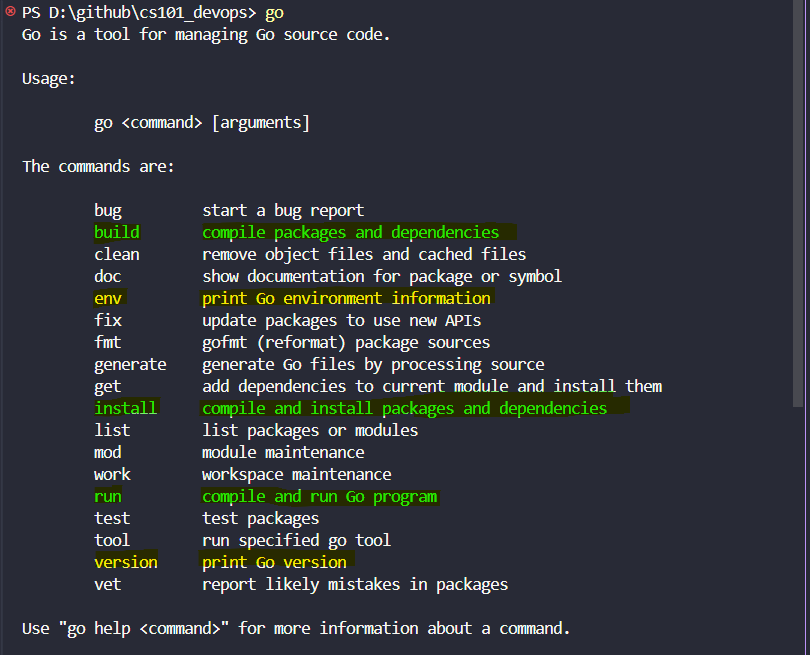

import { LinkCard, Steps, FileTree } from '@astrojs/starlight/components';

_Chúng ta đã đi qua về mã nguồn của chương trình "**Xin chào Việt Nam**" ở **[ngày 8](../day8)**
và **[ngày 9](../day9)**. Ngày hôm nay, xin gửi lời chào đến quý độc giả, và chào mừng quý vị 
đến với "**Không gian làm việc Go**"._

**_Hãy sẵn sàng, và bắt đầu hành trình thôi!!!_** 🛺

## Biến môi trường (GOPATH)

_Bạn có còn nhớ, khi cài đặt Go vào máy, chúng ta chọn các tính năng mặc định cho hệ thống, 
và tạo các thư mục chứa mã nguồn Go ở vị trí của biến môi trường ```GOPATH``` đã được 
lựa chọn. Tất nhiên, ta có thể thay đổi biến môi trường này, nhưng trước hết, hãy kiểm
tra xem biến này đang chứa đường dẫn về thư mục nào._

```bash title="Checking variable..."

~$ echo $GOPATH
home/anthony2708/projects/go

```

_Sau đó chúng ta có ba thư mục được tạo ra._

<FileTree>

- bin
  - gopls.exe
  - staticcheck.exe
  - ...
- pkg
  - mod/
  - sumdb/
- src
  - hello
    - main.go

</FileTree>

- ```src``` : _Nơi lưu trữ **mã nguồn chương trình**. Nơi đây quản lý các gói chứa tên miền cho
tất cả kho lưu trữ Go của mình._
- ```pkg``` : _Nơi chứa các **gói đã/đang được cài đặt trong chương trình**. Điều này giúp tăng
tốc độ biên dịch chương trình khi chỉ cần kiểm tra phiên bản của các gói thay vì tải về lại
từ đầu._
- ```bin``` : _Nơi chứa các **tập tin nhị phân** đã được biên dịch._

_Chương trình "**Xin chào Việt Nam**" này không phải là một thứ quá phức tạp - nếu cần có góc nhìn
thực tế hơn, hãy nhìn vào sơ đồ sau._


> **Nguồn**: [GoChronicles](https://gochronicles.com/)

_Tại website nguồn, mọi người có thể theo dõi chi tiết và tìm hiểu nguyên nhân vì sao cũng như
cách thức cây thư mục này được tổ chức. Bên cạnh đó, mọi người có thể đi sâu hơn vào từng thư
mục cụ thể mà ở đây chưa đề cập đến._

## Biên dịch và chạy chương trình

_Ở **[ngày 9](../day9)**, chúng ta đã biên dịch chương trình, và bây giờ là lúc chúng ta đi sâu 
hơn vào cách thức Go hoạt động._

_Để chạy chương trình, cần biên dịch nó. Để biên dịch chương trình, ta có thể sử dụng một công
cụ cũng có tên là **Go (hay gọi là Go CLI)**. Ta cũng có thể cài đặt và sử dụng thêm các công cụ 
khác của bên thứ ba bên cạnh bộ cài chuẩn của Go._

_Mở cửa sổ dòng lệnh, gõ lệnh sau và ta sẽ thấy loạt hướng dẫn tương ứng._

```bash title="Checking Go..."

go

```



_Chúng ta đã dùng hai câu lệnh màu vàng trong **[ngày 8](../day8)**. Ba câu lệnh màu xanh lá chính là 
ba cách để biên dịch chương trình._

<Steps>
1. ```go run```: _Câu lệnh biên dịch và chạy trực tiếp gói ```main``` bao gồm các tập tin Go chỉ 
định trên cửa sổ lệnh. Câu lệnh này cho phép biên dịch ra một tập tin thực thi ra một **thư mục tạm
thời**._
2. ```go build```: _Câu lệnh biên dịch các gói và thư viện liên quan **tại thư mục hiện thời**. Nếu 
mã nguồn Go có một gói ```main```, câu lệnh này sẽ tạo và đặt tập tin thực thi **ngay tại chính thư
mục đó**. Nếu không, tập tin thực thi này sẽ nằm ở **thư mục ```pkg```**, có thể nhập vào và sử dụng bởi
các chương trình khác. Câu lệnh còn giúp biên dịch chương trình ra các nền tảng **Hệ điều hành** được 
hỗ trợ bởi Go._
3. ```go install```: _Tương tự như câu lệnh số 2, tuy nhiên tập tin thực thi **nằm trong thư mục
```bin```.**_
</Steps>

_**Hết nội dung ngày 10**. Hy vọng rằng mọi người đã đón nhận được phần nào nội dung hôm nay._ 

_Với những cố gắng thường xuyên và liên tục, mình hy vọng rằng tất cả mọi người sẽ đồng hành và ủng hộ bằng 
cách xem những nội dung này, và thêm phần **Tham khảo** ngay dưới đây, vì mình đã tóm gọn lại những nội dung 
phù hợp nhất để mọi người có thể nghiên cứu và tự học về Golang._

## Tài liệu tham khảo 📚

_Mời mọi người chuyển sang trang này để theo dõi tất cả tài liệu liên quan trong giai đoạn 2, 
để giúp bản thân có được những tài liệu hữu ích về Golang trong làm việc với DevOps._

<LinkCard
  title="Ngày 10 - Tham khảo"
  href="../../../reference/golang/day7"
/>

_Hẹn gặp mọi người ở những ngày tiếp theo._ 🚀