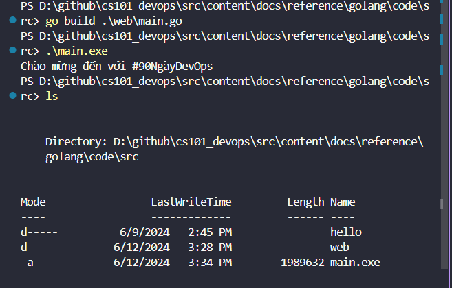
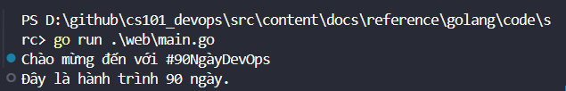
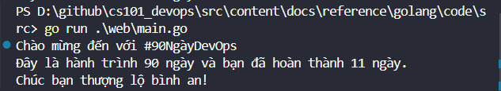

import { LinkCard, Steps } from '@astrojs/starlight/components';

_Chào mừng mọi người đến với ngày 11 của hành trình này. Sau khi chúng ta có được những kiến
thức đầu tiên về Golang, giờ là lúc đi sâu hơn vào các thuật ngữ quan trọng: **Biến số, Hằng
số và Kiểu dữ liệu được sử dụng trong Go ra sao?** Cùng tìm hiểu nhé!_ ⭐

## Biến và hằng số trong Go

_Okay, để lên ý tưởng cho cuộc vui này, mình nghĩ 1 ứng dụng web đơn giản viết bằng Go sẽ phù
hợp với tất cả chúng ta. Ứng dụng này sẽ thông báo sô ngày hoàn thành hành trình cho mọi 
người biết._

_Sau đây là một số thông tin cần nắm:_
- _Biến được dùng để **lưu giá trị**_
- _Biến được sử dụng **trong suốt chương trình** và **có thể thay đổi** tùy thuộc vào yêu cầu._

_Để khai báo biến, chúng ta sẽ sử dụng **từ khóa**. Từ khóa này cũng sẽ nằm trong hàm chính 
(```main```) của chương trình. Mọi người có thể xem các từ khóa của Go tại 
**[đây](https://go.dev/ref/spec#Keywords)**._

:::note

_Tên của biến cần được khai báo và khởi tạo một cách rõ ràng, và biến được khởi tạo cần được 
sử dụng **ít nhất một lần**, nếu không sẽ phát sinh lỗi do biến chưa được sử dụng. Điều này 
cũng tương tự như các gói._

```go title="Defining variables..."

var challenge = "#90NgàyDevOps"

```

:::

_Như vậy bây giờ, đoạn code của chúng ta sẽ bắt đầu như thế này._

```go title="src/main.go"

package main

import "fmt"

func main() {
	var challenge = "#90NgàyDevOps"
	fmt.Println("Chào mừng đến với", challenge, "")
}

```

_Và đây là kết quả khi chạy chương trình._



_Chúng ta cũng biết hành trình này về cơ bản kéo dài 90 ngày, nhưng **không đồng nghĩa nó sẽ 
không kéo dài tới 100 ngày**. Do đó, số ngày của hành trình cần được cố định, người ta gọi 
là **hằng**. Hằng số khác với biến là xuyên suốt chương trình, giá trị hằng số sẽ **không 
thay đổi.**_

_Khi thêm hằng số vào trong mã nguồn cũng như điều chỉnh, ta có chương trình sau._

```go title="src/main.go"

package main

import "fmt"

func main() {
	var challenge = "#90NgàyDevOps"
	const totalDays = 90

	fmt.Println("Chào mừng đến với", challenge, "")
	fmt.Println("Đây là hành trình", totalDays, "ngày.")
}

```

_Kết quả sẽ như thế này._



_Cuối cùng, chúng ta sẽ thêm số ngày hoàn thành dưới dạng **một biến số (vì hành trình vẫn 
kéo dài)**. Hành trình kéo dài, nghĩa là mã nguồn này vẫn còn thay đổi. Dưới đây là bản cập 
nhật và kết quả sau khi chạy chương trình._

```go title="src/main.go"
package main

import "fmt"

func vars() {
	var challenge = "#90NgàyDevOps"
	const totalDays = 90
	var daysCompleted = 11

	fmt.Println("Chào mừng đến với", challenge, "")
	fmt.Println("Đây là hành trình", totalDays, "ngày và bạn đã hoàn thành", daysCompleted, "ngày.")
	fmt.Println("Chúc bạn thượng lộ bình an!")
}
```



_Một phiên bản khác của chương trình cho phép bạn sử dụng hàm ```printf``` thay vì ```println```
để in ra màn hình, **tương tự như C**. Ta sẽ thay thế bằng ```%v``` để chỉ biến số và ```\n``` để
xuống dòng._


```go title="src/main.go"
package main

import "fmt"

func main() {
	var challenge = "#90NgàyDevOps"
	const totalDays = 90
	var daysCompleted = 11

	fmt.Printf("Chào mừng đến với %v\n", challenge)
	fmt.Printf("Đây là hành trình %v ngày và bạn đã hoàn thành %v ngày.\n", totalDays, daysCompleted)
	fmt.Println("Chúc bạn thượng lộ bình an!")
}
```

_Biến số cũng có thể được khai báo đơn giản hơn mà không cần sử dụng từ khóa là ```var```._

:::danger

**_Hăng số không thể làm được điều này._**

:::

```go title="Defining variables in simple ways..."
func main() {
	challenge := "#90NgàyDevOps"
	const totalDays = 90
}

```

## Kiểu dữ liệu trong Go

_Ở ví dụ trên, chúng ta không cần khai báo kiểu dữ liệu cho biến hay hằng, bởi Go đủ thông minh 
để nhận diện được điều này. Nhưng câu chuyện sẽ rẽ sang hướng khác, **nếu có dữ liệu đầu vào từ 
người dùng**._

_Chúng ta đã sử dụng kiểu dữ liệu chuỗi và số nguyên trong mã nguồn. Kiểu số nguyên cho số ngày
và kiểu chuỗi cho tên hành trình._

_Một điều quan trọng cần lưu tâm là mỗi kiểu dữ liệu thực hiện một vai trò khác nhau và sẽ có
cách xử lý khác nhau trên mã nguồn. Thí dụ, số nguyên có thể làm phép tích (nhân) được nhưng 
**không thể nhân hai chuỗi với nhau được**._

### Các kiểu dữ liệu

_Có bốn kiểu dữ liệu chính trong Go._

<Steps>
1. _**Cơ bản**: Bao gồm Số, Chuỗi và Nhị phân (Numbers, Strings, Booleans)_
2. _**Tổng hợp (Aggregate)**: Bao gồm Mảng và Cấu trúc (Arrays, Structs)_
3. _**Tham chiếu (Reference)**: Bao gồm Con trỏ, Lát cắt, Bản đồ, Hàm và Kênh
(Pointers, Slices, Maps, Functions, Channels)_
4. **_Giao diện - Interface_**
</Steps>

_Kiểu dữ liệu là khái niệm quan trọng trong lập trình, chỉ định định dạng cũng như kích thước
của các biến._

:::tip

**_Khi biến số trong Go có một kiểu dữ liệu, nó chỉ có thể lưu dữ liệu đúng kiểu đó._**

:::

### Kiểu cơ bản
_Có ba kiểu cơ bản được dùng trong Go._

<Steps>
1. ```bool```: Nhị phân, nhận hai giá trị đúng (```true```) hoặc sai (```false```)
2. ```Numeric```: Kiểu số, bao gồm số nguyên, số thực và số phức
3. ```string```: Chuỗi ký tự

</Steps>

_Hãy truy cập vào đây để biết thêm về các kiểu dữ liệu trong Go: 
**[Golang by Examples](https://golangbyexample.com/all-data-types-in-golang-with-examples/)**_

_Để khai báo kiểu dữ liệu ta sẽ thực hiện như sau._

```go title="src/main.go"
var webHandle string
var DaysCompleted uint
```
_Do Go tự suy luận biến có giá trị, ta sẽ in ra màn hình các giá trị như sau._

:::caution

**_Dấu ```\``` cho thấy đây là một dòng mã nguồn duy nhất_**

:::

```go title="src/main.go"
fmt.Printf("Hành trình %T, trong %T ngày và hoàn thành %T ngày", \
              challenge, totalDays, daysCompleted)
```

_Đối với kiểu ```Numeric``` có ba kiểu số khác nhau._
- _```int```: Số nguyên có dấu_
- _```uint```: Số nguyên dương không dấu_
- _```float```: Số thực (dấu phẩy động)_

_Hết nội dung ngày 11. **Xin chào tạm biệt!**_ 👋

## Tài liệu tham khảo 📚

_Mời mọi người chuyển sang trang này để theo dõi tất cả tài liệu liên quan trong giai đoạn 2, 
để giúp bản thân có được những tài liệu hữu ích về Golang trong làm việc với DevOps._

<LinkCard
  title="Ngày 11 - Tham khảo"
  href="../../../reference/golang/day7"
/>

_Hẹn gặp mọi người ở những ngày tiếp theo._ 🚀