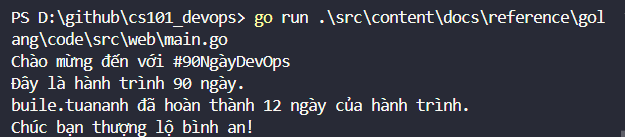
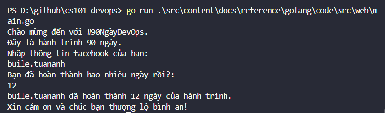
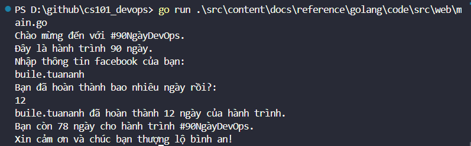
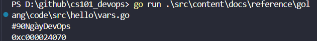

import { LinkCard, Steps } from '@astrojs/starlight/components';

_Xin chào mọi người. Sau một ngày tạm gián đoạn vì lý do khách quan thì ngày 12 của hành trình
đã chính thức quay trở lại rồi đây. Bây giờ là lúc để chúng ta sẽ cải tiến mã nguồn của mình._

**_Nếu bạn đã sẵn sàng, hãy lên đường cùng chúng mình thôi!_** 🚗

## Nhận đầu vào từ người dùng

_Hôm qua, chúng ta đấu cứng giá trị của các biến và hằng số, gồm ```challenge```, 
```totalDays```và ```daysCompleted```. Bây giờ là lúc để chúng ta thêm biến mới và 
điều chỉnh mã nguồn. Kết quả được hiện ngay bên dưới._

```go title="src/main.go"
package main

import "fmt"

func main() {
	challenge := "#90NgàyDevOps"
	const totalDays = 90

	fmt.Printf("Chào mừng đến với %v\n", challenge)
	fmt.Printf("Đây là hành trình %v ngày.\n", totalDays)

	var facebookName string
	var daysCompleted int

	facebookName = "buile.tuananh"
	daysCompleted = 12
	fmt.Printf("%v đã hoàn thành %v ngày của hành trình.\n", facebookName, daysCompleted)
	fmt.Println("Chúc bạn thượng lộ bình an!")
}
```



_Vì số ngày và tên người dùng có thể thay đổi liên tục, do đó cần phải cho phép người dùng
nhập từ đầu vào hệ thống. Chúng ta tiếp tục thay đổi mã nguồn, lần này sẽ sử dụng một hàm
khác từ trong gói ```fmt```._

:::note

_Gói ```fmt``` có nhiều hơn một hàm, phục vụ các tính năng._

<Steps>
1. **_In ra các đầu ra chuẩn các thông tin cần thiết_**
2. **_Nhận thông tin đầu vào của người dùng_**
3. **_Ghi xuống thành một tập tin_**
</Steps>

:::

_Ta sẽ sử dụng câu lệnh sau để cho phép người dùng nhập thông tin._

```go

fmt.Scan(&facebookName)

```

_Dấu ```&``` được chỉ định là một **con trỏ** và chúng ta sẽ tìm hiểu 
ở phần tiếp theo._

_Mã nguồn và kết quả sẽ được thay đổi như sau._

```go title="src/main.go"
package main

import "fmt"

func main() {
	const totalDays int = 90
	challenge := "#90NgàyDevOps"

	fmt.Printf("Chào mừng đến với %v.\n", challenge)
	fmt.Printf("Đây là hành trình %v ngày.\n", totalDays)

	var facebookName string
	var daysCompleted int

	fmt.Println("Nhập thông tin facebook của bạn: ")
	fmt.Scanln(&facebookName)

	fmt.Println("Bạn đã hoàn thành bao nhiêu ngày rồi?: ")
	fmt.Scanln(&daysCompleted)

	fmt.Printf("%v đã hoàn thành %v ngày của hành trình.\n", facebookName, daysCompleted)
	fmt.Println("Xin cảm ơn và chúc bạn thượng lộ bình an!")
}

```



_Việc cuối cùng trong ngày hôm nay, là bổ sung thêm thông tin số ngày còn lại của hành trình, 
để chúng ta có thể dễ dàng kiểm tra hơn lịch trình chuyến đi._

_Chúng ta khai báo thêm một biến có tên là ```remainingDays```. Biến này có giá trị khởi tạo
là ```90```, và điều chỉnh dựa trên công thức sau._

```go
remainingDays = remainingDays - daysCompleted
```

_Mã nguồn chương trình sẽ tiếp tục được cập nhật và kết quả sẽ thay đổi như sau._

```go title="src/main.go"
package main

import "fmt"

func main() {
	const totalDays int = 90
	var remainingDays int = 90
	challenge := "#90NgàyDevOps"

	fmt.Printf("Chào mừng đến với %v.\n", challenge)
	fmt.Printf("Đây là hành trình %v ngày.\n", totalDays)

	var facebookName string
	var daysCompleted int

	fmt.Println("Nhập thông tin facebook của bạn: ")
	fmt.Scanln(&facebookName)

	fmt.Println("Bạn đã hoàn thành bao nhiêu ngày rồi?: ")
	fmt.Scanln(&daysCompleted)

	remainingDays = remainingDays - daysCompleted

	fmt.Printf("%v đã hoàn thành %v ngày của hành trình.\n", facebookName, daysCompleted)
	fmt.Printf("Bạn còn %v ngày cho hành trình %v.\n", remainingDays, challenge)
	fmt.Println("Xin cảm ơn và chúc bạn thượng lộ bình an!")
}
```



## Con trỏ 👆

_Con trỏ được xem như một biến, biến này sẽ trỏ về địa chỉ của một biến khác. Địa chỉ này
có định dạng thập lục phân (ô nhớ). Mọi người có thể tìm hiểu thêm về con trỏ tại 
**[đây](https://www.geeksforgeeks.org/pointers-in-golang/)**_

_Để dễ hiểu, hãy xem đoạn mã nguồn và kết quả sau._

```go title="src/pointers.go"
package main

import "fmt"

func main() {
	var challenge = "#90NgàyDevOps"
	fmt.Println(challenge)
	fmt.Println(&challenge)
}
```


_Giá trị đầu tiên, người ta thường gọi là **tham trị**. Giá trị thứ hai, người ta thường gọi 
là **tham chiếu**._

_Hết nội dung ngày 12. **Xin chào tạm biệt!**_ 👋

## Tài liệu tham khảo 📚

_Mời mọi người chuyển sang trang này để theo dõi tất cả tài liệu liên quan trong giai đoạn 2, 
để giúp bản thân có được những tài liệu hữu ích về Golang trong làm việc với DevOps._

<LinkCard
  title="Ngày 12 - Tham khảo"
  href="../../../reference/golang/day7"
/>

_Hẹn gặp mọi người ở những ngày tiếp theo._ 🚀