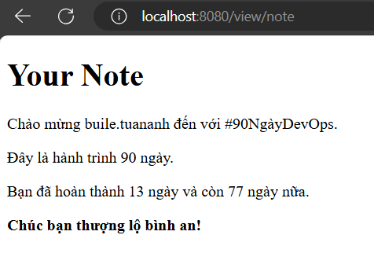

import { LinkCard, Code, FileTree, Steps } from '@astrojs/starlight/components';
import importedCode from '/src/assets/code/src/web/main.go?raw';
import htmlCode from '/src/assets/code/src/web/index.html?raw';
import txtfile from '/src/assets/code/src/web/note.txt?raw';

_Xin chào mọi người, như vậy là sau những ngày bận rộn với nhiều việc thi nhật trình ngày 13
cũng đã sẵn sàng để cho lên sóng rồi đây. Hãy sẵn sàng để chứng kiến ứng dụng của chúng ta
**lên sóng chính thức thôi nào!**_ ✈

## Chỉnh sửa mã nguồn

_Hãy nhìn đoạn mã nguồn hậu chỉnh sửa ngay sau đây. Với mã nguồn này, chúng ta sẽ xây dựng 
một trang web chứa các thông tin liên quan đến hành trình của chúng ta._

<Code code={importedCode} lang="go" title="src/main.go" />

## Cây thư mục

_Với mã nguồn này, cây thư mục ```web``` của chúng ta sẽ có tất cả ba tập tin như sau._

<FileTree>
- src/
  - hello/
    - main.go
  - **web/**
    - index.html
    - note.txt
    - main.go
</FileTree>

### Tập tin index.html 💻
_Một tập tin có phần mở rộng kết thúc bằng .html là một **trang web**. Điểm đặc biệt của tập tin 
này chính là, nếu ta mở nó ở trình duyệt, ta sẽ thấy trọn vẹn trang web đó (giống như web 90 ngày
DevOps chẳng hạn). Tuy nhiên, nếu ta mở ở trình chỉnh sửa tập tin, nó sẽ có cấu trúc như thế này._

```html title="index.html"
<html>
  <head>
    <title>Xin chào Việt Nam</title>
  </head>
  <body>
    <p>Xin chào Việt Nam!</p>
  </body>
</html>
```

_Ở đây, tập tin ```index.html``` sẽ được điều chỉnh để tiếp nhận những thông tin từ chương trình Go của
chúng ta. Cụ thể nó như thế này._

<Code code={htmlCode} lang="html" title="src/index.html" />

- _```html lang="vi"``` chỉ định ngôn ngữ **tiếng Việt** cho trang Web_
- _Các nội dung còn lại vẫn tương tự như cũ, tuy nhiên vẫn có những chỗ lạ lẫm mà ta có thể không rõ như 
```{{ .FacebookName }}``` hay ```{{ .DaysCompleted }}```, ta sẽ lưu ý nó sau._

### Tập tin note.txt 📝

_Đây là nội dung của tập tin._

<Code code={txtfile} lang="txt" title="src/note.txt" />

_Có 3 trường thông tin, gồm **tên [facebook](https://facebook.com/buile.tuananh)**, **số ngày 
hoàn thành (13)** và **số ngày còn lại (77)**, ngăn cách với nhau bằng dấu phẩy. Tập tin này 
có thể điều chỉnh tùy ý._

### Tập tin main.go

#### Đoạn mã nguồn đầu tiên
_Hãy chú ý đoạn mã nguồn này._

```go
import (
	"fmt"
	"html/template"
	"log"
	"net/http"
	"os"
	"strconv"
	"strings"
)
```
_Ngoài thư viện ```fmt``` chuẩn ra, ta có thấy có một loạt các thư viện khác xuất hiện.
Cụ thể như sau._

- _```html/template``` và ```net/http```: Một thư viện chuyên dụng để sử dụng các **tập
tin HTML**, còn thư viện còn lại là thư viện chủ lực trong thực hiện **tạo một máy chủ cho
trang web**._
- _```log``` và ```os```: Cặp thư viện này có hai vai trò: Một là phục vụ **tương tác với
tập tin/hệ điều hành (OS)**, hai là xử lý g**hi nhật trình và báo lỗi** nếu có sự cố xảy ra
trong quá trình vận hành ứng dụng._
- _```strconv``` và ```strings```: Cặp thư viện liên quan đến xử lý **kiểu dữ liệu dạng
chuỗi**, trong đó ```strconv``` là chuyển đổi một biến bất kỳ sang chuỗi hoặc ngược lại._

#### Khối cấu trúc định hình

_Ta tạo một khối cấu trúc như sau._

```go
type Page struct {
	Title         string
	facebookName  string
	daysCompleted uint
	remainingDays uint
}
```
_Khối này định hình trang web của chúng ta chứa những thông tin gì. Kiểu dữ liệu và tên gọi
có thể mọi người đã quen thuộc, nếu chưa, hãy quay lại những ngày trước để xem lại nhé._

#### Hàm xử lý nội dung trang web

```go
func loadPage(title string) (*Page, error) {
	filename := title + ".txt"
	data, err := os.ReadFile(filename)
	if err != nil {
		return nil, err
	}

	parts := strings.Split(string(data), ",")
	if len(parts) != 3 {
		return nil, fmt.Errorf("Thông tin không hợp lệ trong: %s", filename)
	}

	facebookName := parts[0]
	if len(facebookName) == 0 {
		return nil, fmt.Errorf("Facebook không hợp lệ: %s", parts[0])
	}

	daysCompleted, err := strconv.Atoi(parts[1])
	if err != nil {
		return nil, fmt.Errorf("Số ngày không hợp lệ: %s", parts[1])
	}

	remainingDays, err := strconv.Atoi(parts[2])
	if err != nil {
		return nil, fmt.Errorf("Số ngày còn lại không hợp lệ: %s", parts[2])
	}

	stringDaysCompleted := uint(daysCompleted)
	stringRemainingDays := uint(remainingDays)

	return &Page{
		Title:         title,
		facebookName:  facebookName,
		daysCompleted: stringDaysCompleted,
		remainingDays: stringRemainingDays,
	}, nil
}
```

_Hàm này nhận đầu vào chính là tên tập tin văn bản (txt) của chúng ta, đồng thời trả về một
con trỏ tương ứng với trang đó. Hàm chạy như sau._

<Steps>
1. _Mở tập tin văn bản. Nếu không mở được tập tin nào có định dạng tương ứng, **báo lỗi**._
2. _Chia tách dãy thông tin trong tập tin thành ba thông tin khác nhau. Kiểm tra định dạng
và sự tồn tại của cả ba thông tin, nếu có sai sót, **báo lỗi**._
3. _Chuyển đổi ngược trở lại hai thông tin số ngày về kiểu dữ liệu số (**sau khi chuyển sang kiểu
chuỗi để kiểm tra đầu vào**)._
4. _Truyền **tham chiếu (con trỏ)** chứa toàn bộ thông tin tương ứng để chờ tạo một trang web._
</Steps>

#### Hàm xử lý giao diện web
```go
func viewController(w http.ResponseWriter, r *http.Request) {
	title := r.URL.Path[len("/view/"):]
	p, err := loadPage(title)
	t, err := template.ParseFiles("index.html")
	if err != nil {
		http.Error(w, err.Error(), http.StatusInternalServerError)
		return
	}
	totalDays := 90
	challenge := "#90NgàyDevOps"

	data := map[string]interface{}{
		"Title":         p.Title,
		"FacebookName":  p.facebookName,
		"Challenge":     challenge,
		"TotalDays":     totalDays,
		"DaysCompleted": p.daysCompleted,
		"RemainingDays": p.remainingDays,
	}
	if err := t.Execute(w, data); err != nil {
		http.Error(w, err.Error(), http.StatusInternalServerError)
		return
	}
}
```

_Controller, cũng như một cái cần gạt, giúp xử lý toàn bộ ứng dụng web của chúng ta.
Hàm này vận hành như sau._

<Steps>
1. _Đọc đường dẫn và kiểm tra sự hiện diện của tập tin văn bản có tên tương ứng. Cụ thể
là ```view/abc/``` ứng với tập tin ```abc.txt```. Nếu không có, **báo lỗi**._
2. _Tải tập tin mẫu ```index.html``` lên hệ thống, nếu có mẫu. Nếu không có, **báo lỗi**._
3. _**Gán dữ liệu (map)** thông tin của các trường thông tin tương ứng với các biến vào tập
tin mẫu ```index.html``` để xử lý. Đây chính là nơi mà các ký hiệu lạ trong tập tin mẫu của
chúng ta ở phần đầu như ```{{ .FacebookName }}``` hay ```{{ .DaysCompleted }}``` được lưu 
dữ liệu._
</Steps>

#### Hàm chính và kết quả cuối cùng
```go
func main() {
	http.HandleFunc("/view/", viewController)
	log.Fatal(http.ListenAndServe("localhost:8080", nil))
}
```

_Hàm này làm nhiệm vụ khởi động và đưa cần gạt về đúng bộ phận quản lý. Đồng thời, hàm này
cũng sẽ mở kết nối trên cổng **8080** để đưa trang web vận hành cũng như báo lỗi nếu phát 
hiện sai sót._ 

_Chạy chương trình bằng lệnh quen thuộc tại thư mục chứa các tập tin này._

```bash title="Starting the webapp..."

go run main.go

```

**_Đây là kết quả cuối cùng của chúng ta._**



_Nhấn ***```Ctrl+C```*** để kết thúc chương trình._

_Như vậy, **hành trình Golang của chúng ta đã hoàn thành**. Với đoạn mã nguồn này, chúng ta 
còn có thể làm được nhiều điều hơn, ví dụ chỉnh sửa tổng số ngày cũng như tên của một hành 
trình nào đó để người dùng có thể tự nhập vào hệ thống._

**_Hy vọng, tất cả mọi người đã có được những trải nghiệm tuyệt vời cùng điểm dừng chân này._**

## Tài liệu tham khảo 📚

_Mời mọi người chuyển sang trang này để theo dõi tất cả tài liệu liên quan trong giai đoạn 2, 
để giúp bản thân có được những tài liệu hữu ích về Golang trong làm việc với DevOps._

<LinkCard
  title="Ngày 13 - Tham khảo"
  href="../../../reference/golang/day7"
/>

_Hẹn gặp mọi người ở những ngày tiếp theo, nơi mà chúng ta sẽ bắt đầu làm việc với Linux - một
hệ điều hành cực kỳ gần gũi với các lập trình viên cũng như kỹ sư DevOps._ 🚀