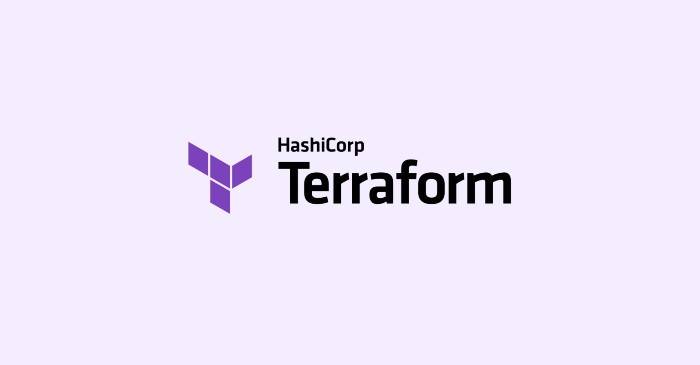

import { LinkCard } from '@astrojs/starlight/components';

_Chào mừng quý vị và các bạn đã đến với ngày thứ 7 của hành trình 90 ngày cùng DevOps. Từ ngày hôm nay, các nội dung sẽ không
chỉ gói gọn trong những dòng chữ lý thuyết suông, mà thêm vào đó, các nội dung thực hành sẽ được triển khai một cách thường
xuyên và liên tục hơn._

_Trong nội dung của Giai đoạn 2 này, chúng ta sẽ đến với câu chuyện về những ngôn ngữ lập trình thường được các "Kỹ sư DevOps"
sử dụng trong quá trình làm việc. Câu hỏi to đùng được đặt ra đó là: Liệu rằng 1 kỹ sư DevOps **có cần phải học lập trình hay
không?** Nếu có, người đó nên **chọn ngôn ngữ lập trình nào** để học đây?_

**_Nếu bạn cũng tò mò về câu trả lời, vậy thì hãy sẵn sàng và bắt đầu thôi!_** 🚌

> **Nguồn**: [AWAI](https://www.awai.com/2017/07/find-the-starting-point-on-your-writing-journey/)

## Học lập trình - Tại sao không?

_Nếu bạn muốn trở thành một kỹ sư DevOps giỏi, nhất định phải học lập trình. Nhưng không phải học để **giỏi hoàn toàn**. Việc 
học lập trình ở đây là để đọc và hiểu được đoạn mã nguồn đó dành cho tính năng gì, từ đó có thể triển khai và cải 
thiện những thứ khác liên quan đến ứng dụng đang thực hiện._

_Nếu để chọn một ngôn ngữ lập trình phù hợp, tôi khuyến nghị **Go** hoặc **Python**. Vì đơn giản, có rất nhiều công cụ DevOps
được viết bằng Python hoặc Go, trong đó **Kubernetes, Docker, Grafana và Prometheus** đều được viết bằng Go. Việc học hai ngôn
ngữ này sẽ giúp ích rất nhiều trong quá trình làm việc sau này._

_Một điều quan trọng cần phải học nữa là cách tương tác, làm việc với các công cụ DevOps, bằng một số công cụ như **Terraform 
hoặc Ansible**. Ngoài ra, chúng ta vào cuối giai đoạn này sẽ học cách biến mọi thứ thành hiện thực bằng việc xây dựng các tập
tin cấu hình viết bằng **YAML**._

> **Nguồn**: [VTI TechBlog](https://vtitech.vn/terraform-for-beginner-gioi-thieu-ve-iac-va-terraform/)

## Liệu không học có ổn không?

_Trong thực tế, công việc của một kỹ sư DevOps sẽ thường là khắc phục sự cố về hiệu năng của ứng dụng, và mỗi ứng dụng sẽ có 
một bộ khung ngôn ngữ và công cụ riêng cần được sử dụng. **Không nhất thiết thứ bạn cần biết là thứ bạn cần học** - JavaScript 
sẽ phù hợp hơn cho một ứng dụng sử dụng NodeJS là bộ khung cho phần xử lý (backend) của ứng dụng thay vì Go hay Python._

> **Nguồn**: [Ositcom](https://ositcom.com/blog/what-is-new-in-nodejs-21/)

## Go - Tại sao lại là nó?

_Go là ngôn ngữ lập trình tiếp theo cho DevOps và trở thành ngôn ngữ lập trình rất phổ biến trong những năm gần đây. Mặc dù
đứng **hạng 13** trong bảng xếp hạng năm 2023 của **[StackOverflow](https://survey.stackoverflow.co/2023/#technology-most-popular-technologies)**,
trong khi Python đứng **thứ 3**, thế nhưng không vì thế mà Go đánh mất sức hút thật sự của mình._

> **Nguồn**: [Monterail](https://www.monterail.com/blog/go-vs-python)

### Xây dựng ứng dụng bằng Go

_Một điểm đặc thù với Python chính là: Đây là một ngôn ngữ ở dạng **thông dịch**, đồng nghĩa với việc bản thân lập trình viên
sẽ không cần tự biên dịch chương trình ra mã máy, giúp **tiết kiệm thời gian** đối với các tác vụ quan trọng._

_Trong khi đó, Go lại là ngôn ngữ dạng **biên dịch, không khác C++ hay Java** là mấy. Điểm quan trọng cần lưu ý là tốc độ biên
dịch chương trình ra mã máy của Go là **tương đối nhanh**, do đó sẽ là tối ưu hơn nếu bạn từng làm quen với C/C++ hay Java 
trong một khoảng thời gian trước đây._

### DevOps với Go và Python

_Các chương trình Go được liên kết tĩnh, điều này có nghĩa khi biên dịch một chương trình viết bằng Go, mọi thứ đều được 
chứa trong **một tệp thực thi nhị phân duy nhất** và không cần cài đặt thêm các thư viện bên ngoài trên các máy chủ. Điều này 
giúp cho việc triển khai các chương trình viết bằng Go dễ dàng hơn. Với Python, chúng ta có các ứng dụng sử dụng các thư viện 
bên ngoài, đồng nghĩa với việc cần phải đảm bảo các thư viện được **cài đặt trên máy chủ trước** khi chạy chương trình._

_Go là một ngôn ngữ **không phụ thuộc hệ điều hành**, có nghĩa là bạn có thể tạo ra các tập tin thực thi cho tất cả các hệ 
điều hành như **Linux, Windows, macOS, v.v...** Python không dễ dàng làm được điều tương tự._

_Go là một ngôn ngữ có **hiệu năng cao**, có **khả năng biên dịch**, **thời gian chạy nhanh** và sử dụng **ít tài nguyên hơn**
đặc biệt so với Python. Nhiều hệ thống tối ưu đã được viết bằng Go đem đến hiệu suất rất cao (chi tiết có trong phần tài liệu 
tham khảo)_

_Không giống như Python thường yêu cầu sử dụng thư viện của bên thứ ba để triển khai một chương trình cụ thể, Go có một **kho 
thư viện tiêu chuẩn** với hầu hết các chức năng cần thiết cho DevOps được tích hợp sẵn. Nó bao gồm xử lý tệp, dịch vụ web HTTP,
xử lý JSON, hỗ trợ cho xử lý đồng thời và song song (concurency, parallelism) cũng như kiểm thử tích hợp (built-in testing)._

_Điều này không có nghĩa là chúng ta bỏ qua Python như một **lựa chọn thứ hai**. Người ta nói rằng một khi học được ngôn 
ngữ lập trình đầu tiên, việc tiếp nhận các ngôn ngữ lập trình khác cũng trở nên dễ dàng hơn._

:::tip

_**Một sự thật đắng lòng**: Có lẽ không có công việc nào trong bất kỳ công ty nào không liên quan đến việc quản lý, thiết kế, 
và gỡ lỗi các ứng dụng JavaScript hoặc NodeJS._

:::

## Tài liệu tham khảo 📚

_Mời mọi người chuyển sang trang này để theo dõi tất cả tài liệu liên quan trong ngày đầu tiên của giai đoạn 2, 
để giúp bản thân có được những góc nhìn đa chiều và sống động hơn về những ngôn ngữ lập trình nên học khi làm 
DevOps._

<LinkCard
  title="Ngày 7 - Tham khảo"
  href="../../../reference/golang/day7"
/>

_Hẹn gặp mọi người ở những ngày tiếp theo._ 🚀