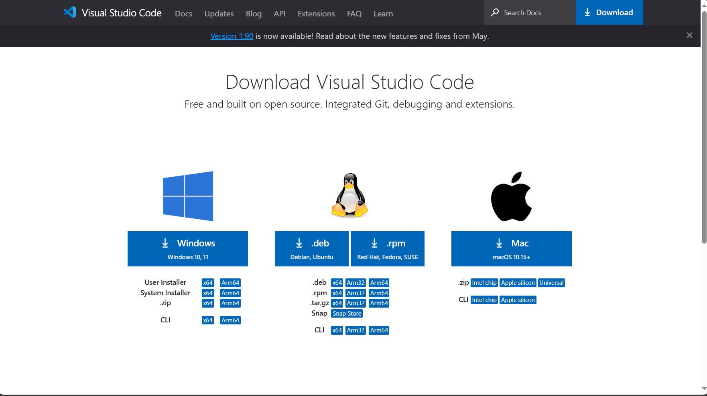
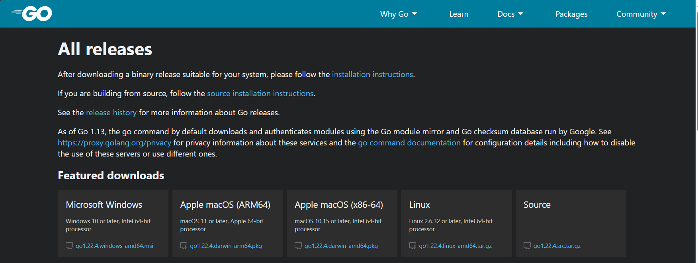
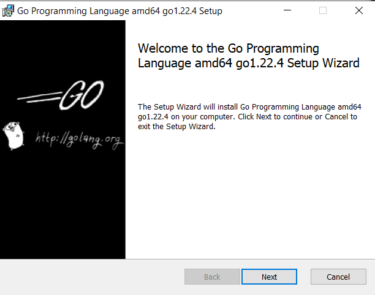
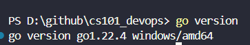
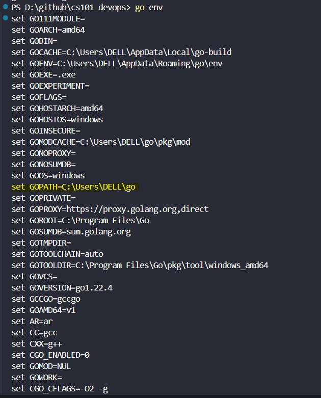
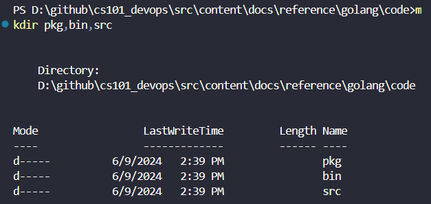
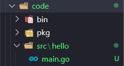
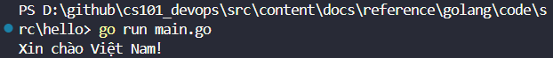
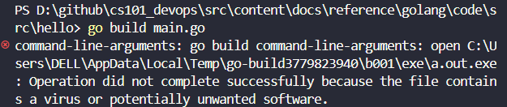

import { LinkCard, Code } from '@astrojs/starlight/components';
import importedCode from '/src/assets/code/src/hello/main.go?raw';


_Đây là ngày thứ 8 của chặng hành trình, và ngày này sẽ không có bất kỳ tài liệu tham khảo nào, bởi lẽ, chúng ta sẽ sử dụng
chung một bộ tài liệu đã có từ ngày 07 trở đi._

**_Còn bây giờ, bắt đầu chuyến hành trình nào!_** 🚘

## Cài đặt Go và Visual Studio Code 🛠

_Trước hết, ta cài đặt một **IDE (Môi trường Phát triển tích hợp)** cho việc lập trình lý tưởng. Ở đây tôi chọn 
**[Visual Studio Code](https://code.visualstudio.com/Download)**._



> **Nguồn**: [VSCode](https://code.visualstudio.com/)

_Tiếp theo, ta cài đặt Go vào máy tính của mình. Truy cập đường dẫn **[này](https://go.dev/dl/)** để tải bộ cài 
tương ứng với hệ điều hành đang sử dụng._



> **Nguồn**: [Golang](https://go.dev/)

_Bắt đầu quá trình thực hiện (**ở quá trình này, nếu trước đó đã cài phiên bản cũ, hệ thống sẽ gỡ bỏ và cài đặt
phiên bản mới**):_



_Sau khi cài đặt xong, mở **Visual Studio Code**, sau đó mở **Command Prompt (Trình nhắc lệnh)** để kiểm tra
phiên bản đã cài đặt._

```bash title="Checking Go version..."

go version

```



_Tiếp theo, ta kiểm tra vị trí cho môi trường làm việc với Go. Nếu bạn muốn làm việc ở một thư mục khác, ta phải thay đổi
bằng cách thêm thư mục cần dùng vào biến **GOPATH**._

```bash title="Checking and editing environment variables..."

go env
go env -w GOPATH=<your-path>
```



## Xin chào thế giới!!! Xin chào Việt Nam!!!

_Tạo tiếp ba thư mục ```pkg```, ```bin```, ```src``` trong thư mục ta xác định **GOPATH** và thư mục con ```hello``` trong 
```src```._



_Trong thư mục ```hello```, tạo một file có tên là ```main.go```._



_Sau đó, đưa nội dung này vào bên trong tập tin._

<Code code={importedCode} lang="go" title="src/main.go" />

_Kiểm tra xem chương trình có chạy đúng như kỳ vọng hay không. Nếu chương trình đã chạy đúng kỳ vọng, chúng ta sẽ xuất chương
trình ra một tập tin thực thi khác._

```bash title="Running the code..."

go run main.go

```


```bash title="Building the program..."

go build main.go

```

_Trong một số trường hợp, Microsoft Defender sẽ đánh dấu tập tin .exe là **mã độc (mặc dù nội dung không chứa mã độc)**.
Lúc này, việc cần làm là đưa thư mục chứa mã nguồn vào trạng thái loại trừ._



_Dưới đây là một hình ảnh nếu như đưa vào loại trừ thành công (**lấy từ bản gốc của series**)._


_Nếu đem tập tin thực thi (.exe) đó sang máy khách chạy, kết quả sẽ là tương tự._

```powershell title="Running the code on different machine..."
> ./main.exe
Xin chào Việt Nam!

```
_Hoàn thành bài tập ngày 08. **Xin chào thế giới, xin chào Việt Nam!!!**_

## Tài liệu tham khảo 📚

_Mời mọi người chuyển sang trang này để theo dõi tất cả tài liệu liên quan trong giai đoạn 2, 
để giúp bản thân có được những tài liệu hữu ích về Golang trong làm việc với DevOps._

<LinkCard
  title="Ngày 8 - Tham khảo"
  href="../../../reference/golang/day7"
/>

_Hẹn gặp mọi người ở những ngày tiếp theo._ 🚀