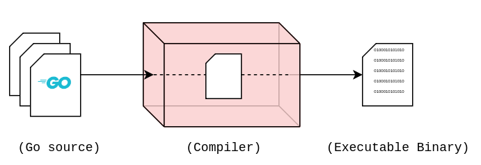

import { LinkCard, Code, Steps } from '@astrojs/starlight/components';
import importedCode from '/src/assets/code/src/hello/main.go?raw';

_Xin chào mọi người, cuối cùng cũng đã đến lúc chúng ta sẽ phân tích đoạn mã nguồn Xin chào Việt Nam
trong ngày thứ 8 vừa rồi. **Nếu bạn đã sẵn sàng, hãy bắt đầu thôi!**_

## Cách Go hoạt động

_Go cũng giống như C++ hay Java, đều là ngôn ngữ theo dạng **biên dịch** - chương trình cần phải được
dịch ra **mã máy** (**mã máy là mã nhị phân - hệ 2 chữ số 0 và 1**) để máy tính có thể hiểu và chạy được._

_Trong ngày 8 chúng ta sử dụng một câu lệnh: ```go build main.go```. Đây là cách chúng ta biên
dịch chương trình._



## Package - Gói 📦

_Gói là tập hợp các **tập tin mã nguồn trong cùng thư mục được biên dịch cùng nhau**. Khi viết một
chương trình Go phức tạp với nhiều thư mục hơn, mỗi thư mục khi được biên dịch sẽ tạo thành một
gói._

_Gói là một cách giúp ta **tái sử dụng mã nguồn** mà không cần viết lại từ đầu. Điều này giúp chúng ta
dễ dàng **quản lý và tiết kiệm thời gian, công sức** xây dựng ứng dụng hơn. Giả sử nếu chúng ta tạo ra
một máy tính cầm tay bằng Go, các gói liên quan đến các hàm tính toán khi được **nhập (import)** vào
chương trình sẽ giúp giảm được rất nhiều thời gian cho việc phải xây dựng lại từ đầu._

## Phân tích lời chào 👋

**_Đây là đoạn mã nguồn chúng ta sử dụng trong ngày 8._**

<Code code={importedCode} lang="go" title="src/main.go" />

_Chúng ta bắt đầu phân tích từng dòng của đoạn mã nguồn này._

### Dòng 1

```go ins="package main"
package main

import "fmt"

func main() {
    fmt.Println("Xin chào Việt Nam!")
}
```

_Rõ ràng ta có thể nhận diện được gói mà chương trình thuộc về có tên là ```main```. Đây là 
đầu vào của chương trình, chứa các tập tin mã nguồn viết bằng Go sử dụng cho hàm chính của 
chương trình._

_Tất nhiên ta sẽ có thể chọn tên các gói khác dưới dạng ```package <name>``` cho chương trình._

### Dòng 5

```go {5}
package main

import "fmt"

func main() {
    fmt.Println("Xin chào Việt Nam!")
}
```
_Ở mỗi chương trình, cần xác định vị trí hàm chính chương trình sẽ chạy, đây là nơi mà máy sẽ
theo dõi và bắt đầu vận hành ứng dụng._

_Hàm là một đoạn mã nguồn có nhiệm vụ **thực hiện một tính năng bất kỳ**, có thể sử dụng **xuyên 
suốt chương trình**._

### Dòng 3 và 6

```diff lang="go" {6} 
package main

+ import "fmt"

func main() {
    fmt.Println("Xin chào Việt Nam!")
}
```

_Dòng 3 cho thấy, ```fmt``` là một thư viện chuẩn của Go, được thêm vào để sử dụng được hàm 
```Println()``` tại **dòng 6** của chương trình. Hệ thống thư viện chuẩn của Go như đã đề cập
ở ngày 8 có rất nhiều mà chúng ta có thể sử dụng, tiết kiệm rất nhiều nguồn lực cho chúng ta.
Để xem trọn vẹn những thư viện chuẩn có sẵn, truy cập vào **[đây](https://pkg.go.dev/std)**._

_Ở **dòng 6**, hàm ```Println()``` cho phép in những dữ liệu về **đầu ra chuẩn (màn hình/cửa sổ
lệnh)** để thông báo chương trình chạy thành công. Bạn có thể thay đổi thử thông điệp giữa 
hai dấu ```""``` và chạy lại chương trình bằng câu lệnh sau để xem kết quả._

```bash title="Running the code..."

go run main.go

```

### Tóm tắt

<Steps>
1. _**Dòng 1**: Tập tin mã nguồn sẽ ở trong gói tên ```main```, và phải dùng tên này, vì nó 
chứa đầu vào chương trình._
2. _**Dòng 3**: Để sử dụng hàm ```Println()``` trong chương trình, cần thêm gói ```fmt```._
3. _**Dòng 5**: Đầu vào chính của chương trình, máy chạy hàm chính tại dòng này._
4. _**Dòng 6**: In ra màn hình câu "**Xin chào Việt Nam!**"._
</Steps>

**_Hoàn thành phân tích ngày 9._**

## Tài liệu tham khảo 📚

_Mời mọi người chuyển sang trang này để theo dõi tất cả tài liệu liên quan trong giai đoạn 2, 
để giúp bản thân có được những tài liệu hữu ích về Golang trong làm việc với DevOps._

<LinkCard
  title="Ngày 9 - Tham khảo"
  href="../../../reference/golang/day7"
/>

_Hẹn gặp mọi người ở những ngày tiếp theo._ 🚀