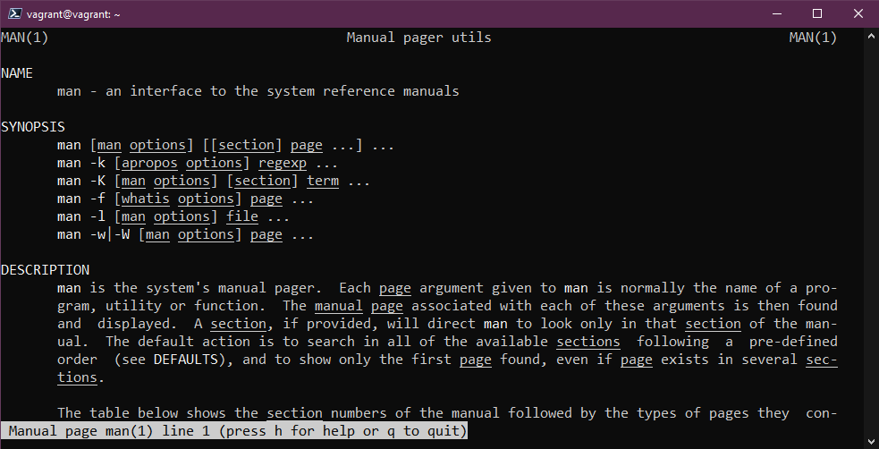
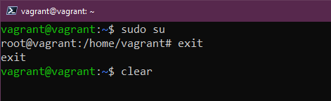
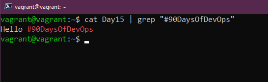
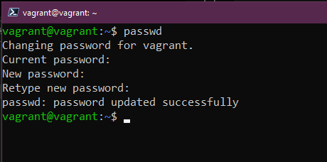
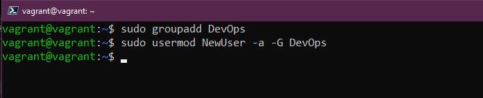
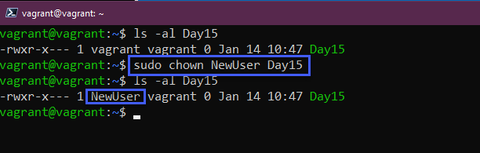
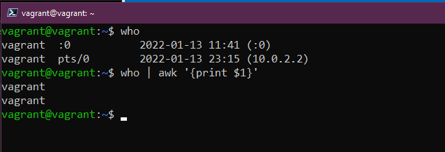

import { LinkCard, Steps } from '@astrojs/starlight/components';

_Xin chào, đã đến lúc Linux lên sóng rồi. Bây giờ sẽ là lúc mà chúng ta sẽ học các câu lệnh Linux một cách chỉnh chu
nhất. Đây là ngày thứ 15 của hành trình, và **mời mọi người đi cùng mình nào!**_ 🚓

## Dạo quanh làng "Command"

_Làng này có rất nhiều "command" - nhưng để tiện di chuyển hơn, chúng ta sẽ chỉ đi qua một số "command" chính thôi._

### Lệnh ```man```

_Lệnh xem hướng dẫn sử dụng. Cách dùng đơn giản như sau._

```bash title="Checking user guide..."
man <command>
```




### Từ khóa ```sudo```

_```sudo``` là một từ khóa đặc biệt - nó cấp cho người dùng quyền ```root``` tạm thời để thực hiện các yêu cầu khác 
nhau, khá giống **Run as Administator - Chạy với quyền Quản trị viên** trên Windows._

```bash title="Doing things in admin mode..."

sudo <command>

```

_Trong trường hợp nếu cần vào thẳng ```root``` để thực hiện các công việc, sử dụng câu lệnh sau và nhập mật khẩu.
Thoát khỏi quyền ```root``` bằng lệnh ```exit```_

```bash title="Going into root mode..."
sudo su
```


```bash title="Exiting root..." 
exit
```

### Xóa màn hình

_Với Linux, người ta có câu: **Sạch gàu như Clear...** à nhầm, sạch command như ```clear```. 
Windows thì dùng ```cls```._

```bash title="Clearing screen..."
clear
```



### Xử lý với thư mục và tập tin

_Chùm câu lệnh xử lý bao gồm tạo thư mục, tạo tập tin, xóa thư mục, thay đổi thư mục, kiểm 
tra thư mục hiện thời và thao tác với các tập tin chứa trong thư mục._

#### Thư mục

```bash title="Creating folder..."
mkdir <name>
```

```bash title="Deleting folder..."
rmdir <name>
```

```bash title="Changing working directory..."
cd <name>
```

```bash title="Checking working directory..."
pwd
```

```bash title="Checking files in folder..."
ls
```

:::note

**_Với ```rmdir```, chỉ khi thư mục trống, chúng ta mới sử dụng được câu lệnh này._**

:::

#### Tập tin

```bash title="Creating files..."
touch <filename>
```

_Câu lệnh sau giúp chúng ta xác định vị trí của tập tin. Trong trường hợp không có kết quả,
chạy đồng thời hai câu lệnh ```sudo apt install mlocate``` và ```sudo updatedb``` trước khi
chạy lại lệnh ```locate```._

```bash title="Checking file location..."
locate <filename>
```


_Di chuyển tập tin sang vị trí khác, sử dụng câu lệnh sau. Câu lệnh này cũng có thể dùng để
**đổi tên tập tin**._

```bash title="Moving/renaming files..."
mv <file> <new location>
```


```bash title="Deleting files..."
rm <filename> # Remove file, xóa thường
rm -R <filename> # Remove recursively, xóa đệ quy, tức tìm trong các thư mục
rm -R -f <filename> # Remove forcefully, buộc xóa đệ quy
```

:::danger

***ĐỪNG BAO GIỜ CHẠY LỆNH NÀY TRONG LINUX NẾU BẠN KHÔNG MUỐN HỎNG TOÀN BỘ HỆ THỐNG***

```bash title="Deleting OS..."
sudo rm -R -f / # SAY NO TO THIS COMMAND
```
:::

_Nếu bạn muốn sao chép một tập tin sang nơi khác, sử dụng câu lệnh sau._

```bash title="Copying files..."
cp <filename> <new location>
```

_Hãy thêm chút gia vị vào món ăn của mình và xem nó có gì nào..._

```bash title="Adding content and checking..."
echo "Xin chào Việt Nam!" > <filename>
cat <filename> | grep "Xin chào"
```




### Tìm lại bản đồ
_**Thất lạc trong làng và không biết mình đã đi đâu?** Dùng các câu lệnh sau để tìm lại._

```bash title="Checking history..."
history # Checking history, xem lịch sử
history -c # Clearing history, xóa lịch sử
history | grep <command> # Checking specific command, câu lệnh cụ thể
history ![n] # Check nth command in history, câu lệnh thứ n trong lịch sử
```
_Trên các hệ thống Linux, biến sau giúp quản trị được thời gian câu lệnh được thực thi, ta 
có thể ghi nó vào trong ```bash_profile``` để xuất ra màn hình._

```bash
HISTTIMEFORMAT="%d-%m-%Y %T " 
echo 'export HISTTIMEFORMAT="%d-%m-%Y %T "' >> ~/.bash_profile
```
_Ta cũng có thể tăng kích thước lịch sử._

```bash title="Increasing size..."
echo 'export HISTSIZE=100000' >> ~/.bash_profile
echo 'export HISTFILESIZE=10000000' >> ~/.bash_profile
```


### Thao tác với người dùng

_Các thao tác bao gồm thêm và điều chỉnh người dùng, nhóm cũng như đổi mật khẩu._

#### Đổi mật khẩu

```bash title="Changing password"
passwd # Đổi password không lộ thông tin trên lịch sử
passwd -p <password> # Đổi password lưu vết trên lịch sử
```



#### Thêm người dùng và nhóm

```bash
sudo useradd NewUser # Thêm người dùng NewUser
sudo groupadd DevOps # Thêm nhóm người dùng DevOps
sudo usermod NewUser -a -G DevOps # Thêm NewUser vào nhóm DevOps
usermod -a -G sudo NewUser # Thêm NewUser vào nhóm sudo, hiếm gặp
```




## Quyền hạn của người dùng

_Đây là cách mà chúng ta hiểu về quyền hạn trên Linux._

- _**4** = Read (Đọc, **R**)_
- _**2** = Write (Ghi, **W**)_
- _**1** = Execute (Thực thi, **X**)_

_Lúc này, chúng ta sẽ ghi nhớ theo thứ tự quyền hạn được phân như sau: 
**Người dùng - Nhóm người dùng - Người khác**._

_Đi vào nội dung, hãy xem tấm hình này sau khi chạy ```ls -la```, tức xuất
dưới dạng danh sách toàn bộ thông tin của tập tin đó._


_Ta thấy được thứ này: ```-rw-rw-r--```. Phân giải ta có thông tin sau._

<Steps>
1. _**Loại chỉ mục**: Tập tin (-). Nếu là thư mục, phần này phải bắt đầu bằng chữ ```d```._
2. _**Quyền cho người dùng** ```vagrant```: ```rw-``` = 6 (4+2), quyền đọc ghi_
3. _**Quyền cho nhóm người dùng** ```vagrant```: ```rw-``` = 6 (4+2), quyền đọc ghi_
4. _**Quyền cho người khác**: ```r``` = 4, quyền chỉ đọc._
</Steps>

_Ta sẽ thay đổi quyền hạn sao cho hợp lý bằng cách dùng lệnh sau._

```bash title="Changing permissions..."
sudo chmod 750 <filename> # Quyền chuyển thành -rwxr-x---, Người dùng có toàn quyền, nhóm không có quyền ghi
sudo chmod 750 -R <name> # Đổi quyền cho toàn thư mục
sudo chmod uo+x,g-x <filename> # Tăng quyền thực thi cho người dùng và người khác, nhưng lại rút quyền thực thi cho nhóm
```


_Ta cũng có thể thay đổi luôn chủ nhân của tập tin/thư mục._

```bash title="Changing owner..."
sudo chown <filename> # Đổi người dùng quản lý tập tin
sudo chgrp -R <name> # Đổi nhóm quản lý cho toàn thư mục
```


## Thao tác trên luồng dữ liệu

_Chúng ta khởi động bằng câu lệnh ```awk``` này. Đây là câu lệnh chỉ lấy một phần thông tin 
từ câu lệnh khác._

```bash title="Checking one column..."
who | awk '{print $1}' # Lấy cột đầu tiên của kết quả lệnh who  
```



_Trong trường hợp chúng ta muốn lấy kết quả câu lệnh thành đầu vào của câu lệnh khác, ta sử 
dụng ```xargs```. Đây là cách chúng ta thao tác với nó._

```bash title="Getting arguments..."
cut -d: -f1 < /etc/passwd | sort | xargs

# cut -d: -f1 < /etc/passwd: Lấy toàn bộ thông tin tài khoản trên hệ thống
# sort: Lọc theo thứ tự
# xargs: Biến nó thành tham số của câu lệnh khác
```


_Câu lệnh cuối cùng là ```cut``` - Câu lệnh giúp chúng ta cắt dữ liệu và chỉ lấy một phần dữ
liệu trên mỗi dòng của tập tin. Ví dụ như phần dưới._

```bash title="Getting just some data on each line..."
cut -d " " -f 2 list.txt 
# Từ vị trí ngăn cách (-d) là dấu cách, chỉ lấy thêm 2 bytes mỗi dòng
```


_Nếu bấm nhầm, nhấn ```Ctrl + C``` để ngừng lệnh._

**_Chúng ta kết thúc ngày 15 của hành trình tại đây._**

## Tài liệu tham khảo 📚

_Mời mọi người chuyển sang trang này để theo dõi tất cả tài liệu liên quan trong giai đoạn 3, 
để giúp bản thân có được những tài liệu hữu ích về Linux trong làm việc với DevOps._

<LinkCard
  title="Ngày 15 - Tham khảo"
  href="../../../reference/linux/day14"
/>

_Hẹn gặp mọi người ở những ngày tiếp theo._ 🚀