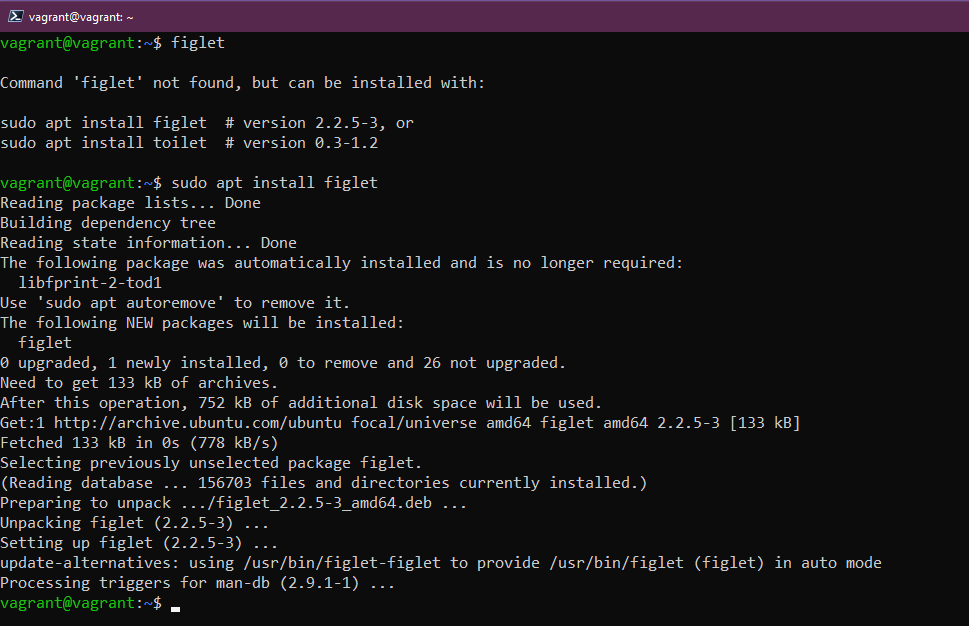

import { LinkCard, Steps, FileTree } from '@astrojs/starlight/components';

_Đây là ngày thứ 16 của hành trình rồi, và chắc hẳn mọi người cũng đã có cái nhìn tổng quan về 
các câu lệnh trong Linux rồi. Ngày hôm nay, chúng ta sẽ khám phá bên trong Linux xem ở đó sẽ 
có những điều gì thú vị đang chờ đón. **Nào, lên đường thôi!**_ 🚌

## Ubuntu và Phần mềm 📲

_Đối với các hệ điều hành dòng Linux, việc thao tác với kho lưu trữ phần mềm là cực kỳ cần thiết để
có được các bản dựng mới của các ứng dụng trên máy. Để thực hiện thì ta sẽ sử dụng các lệnh sau._

```bash title="Working with repositories..."

sudo apt-get update # Hoặc sudo apt update
sudo apt install <package name> # Cài thêm một phần mềm (package) mới
sudo apt remove <package name> # Xóa đi một phần mềm (package)

```





:::note

_Với một số gói khác, cần phải xác định được ***khóa truy nhập*** trước khi thêm 
vào hệ thống._


:::

## Hệ thống tập tin 📁

_Dưới đây là một số thông tin về các thư mục trong Linux mà bạn có thế sẽ gặp qua. Để biết
nội dung bên trong các thư mục này, việc đơn giản là chạy câu lệnh sau._

```bash title="Working with directories"
cd <name>
ls
```

<FileTree>
- **/**
  - bin/
  - boot/
  - dev/
  - **etc/**
  - **home/**
  - lib/
  - media/
  - **mnt/**
  - opt/
  - proc/
  - root/
  - run/
  - sbin/
  - tmp/
  - **usr/**
  - var/
</FileTree>

<Steps>
1. ```/```: _Chứa toàn bộ thư mục Linux (**tương tự ổ C trên Windows**)._
2. ```bin/```: _Chứa các tập tin nhị phân cần thiết cho hệ thống._
3. ```boot/```: Chứa các tập tin khởi động hệ thống.
4. ```dev/```: _Chứa thông tin về các thiết bị như ổ cứng._
5. ```etc/```: _Chứa toàn bộ tập tin cấu hình._
6. ```home/```: _Đây là thư mục chứa các thư mục con và tập tin của 
tất cả người dùng. Ở đây có cả **Documents** và **Desktop**, là hai
thư mục đã từng làm việc trước đó._
7. ```lib/```: _Chứa thư viện dùng chung cho các tập tin nhị phân ở 
```bin/```._
8. ```media/```: _Chứa các thiết bị ngoại vi._
9. ```mnt/```: _Điểm mount tạm thời, **sẽ hiểu thêm ở phần sau**._
10. ```opt/```: _Gói phần mềm bổ trợ._
11. ```proc/```: _Chứa thông tin tiến trình và nhân._
12. ```root/```: _Thư mục ```home``` của quyền ```root```._
13. ```run/```: _Nơi chứa thông tin trạng thái ứng dụng._
14. ```sbin/```: _Sudo bin, tức là thư mục ```bin``` nhưng dành cho 
```sudo```._
15. ```tmp/```: _Chứa tập tin tạm thời._
16. ```usr/```: _Nếu cài ứng ụng thì thường ứng dụng sẽ được cài vào
thư mục ```/usr/bin```._
17. ```var/```: _Nơi chứa tập tin nhật trình từ các ứng dụng ở thư mục
```bin/```_
</Steps>


_Giả sử, bạn muốn quay về lại nhà của mình **khi đã lạc ở đâu đó?** Chỉ cần chạy câu 
lệnh sau là được._

```bash title="Back to home..."

cd ~

```

## Lưu trữ trên ổ cứng 💾

_Chúng ta thường hay có thói quen cài phần mềm vô tội vạ và **quên xóa đi** khi không dùng đến -
nó dẫn đến câu chuyện **hỏng ổ cứng** khiến series này bị dừng một thời gian. Để biết chắc chắn
bạn còn bao nhiêu dung lượng cho ổ cứng, hãy sử dụng câu lệnh sau._

```bash title="Checking disk..."

lsblk

```


_Theo hình ảnh, ```sda``` là ổ cứng của chúng ta, và ```sda1```, ```sda2```, ```sda5``` là các
phân vùng trên ổ cứng._

_Để biết thêm thông tin **chi tiết**, ví dụ về dung lượng còn trống, hãy sử dụng câu lệnh sau._

```bash title="Checking disk details..."

df 
df -h # Phiên bản người đọc, không phải máy đọc

```


_**Câu chuyện mới đây**: Giả sử bạn trúng xổ số Vietlott và bạn quyết định mua thêm ổ cứng, 
làm sao để **đưa ổ cứng vào sử dụng?** Sau khi cắm vào, bạn thực hiện các bước sau._

<Steps>
1. _Định dạng ổ cứng theo câu lệnh Linux._

   ```bash title="Formatting disk..."
   sudo mkfs -t ext4 /dev/sdb
   ```
2. _Mount ổ cứng tại thư mục ```mnt/```._
   
   ```bash title="Mounting disk..."
   cd mnt/
   sudo mkdir NewDisk
   sudo mount /dev/sdb NewDisk
   ```
3. _(**Tùy chọn**) Thêm ổ cứng vào trong tập tin ```/etc/fstab``` để lưu cấu hình mount, 
tránh tình trạng mất điểm mount sau khi khởi động lại._
4. _Kiểm tra bằng câu lệnh sau, **ngay sau khi cài đặt automount**._

   ```bash title="Checking mount point..."
   sudo mount -a
   ```

5. _Ngừng mount nếu không muốn sử dụng tiếp ổ đĩa, sử dụng câu lệnh sau._

   ```bash title="Unmounting disk..."
   sudo unmount /dev/sdb
   ```
</Steps>

**_Kết thúc ngày thứ 16 của hành trình. Xin chân thành cảm ơn._**

## Tài liệu tham khảo 📚

_Mời mọi người chuyển sang trang này để theo dõi tất cả tài liệu liên quan trong giai đoạn 3, 
để giúp bản thân có được những tài liệu hữu ích về Linux trong làm việc với DevOps._

<LinkCard
  title="Ngày 16 - Tham khảo"
  href="../../../reference/linux/day14"
/>

_Hẹn gặp mọi người ở những ngày tiếp theo._ 🚀