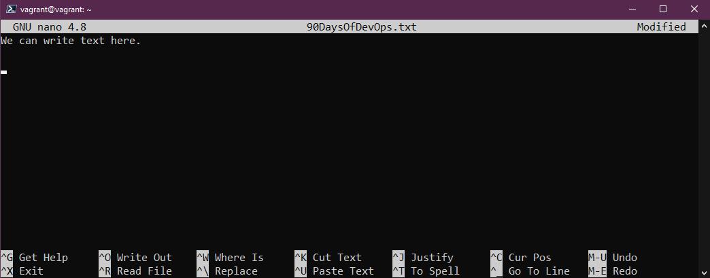
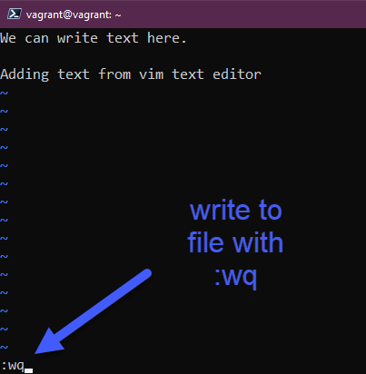

import { LinkCard, Steps } from '@astrojs/starlight/components';

_Đã đến lúc chúng ta đi sâu một chút vào cái giao diện mà chúng ta chứng kiến trên các máy chủ
Linux - một giao diện chỉ toàn **màu đen trắng, với vài dòng lệnh** mà chả có hình nền đẹp nào 
xuất hiện. Chúng ta sẽ làm quen về hai trình biên soạn thường được sử dụng trên Linux - **Nano 
và VIM**, để hiểu hơn hết về cách chúng hoạt động và cách chúng ta tương tác với chúng hiệu quả 
và nhanh gọn._

**_Đây là ngày thứ 17 của hành trình, và hãy đi cùng chúng tôi!_** 🚎

## Nano

- **_Không khả dụng trên tất cả hệ thống_**
- _Phù hợp cho việc bắt đầu làm quen, cũng như với các cấu hình thay đổi nhỏ_

_Khởi động nano bằng một câu lệnh cực kỳ đơn giản và thêm vài dòng dữ liệu vào tập tin bất kỳ._

```bash title="Opening Nano..."
nano 90DaysOfDevOps.txt
```



_Lưu dữ liệu và xem tập tin bằng các lệnh sau._

<Steps>
1. _Lưu dữ liệu bằng tổ hợp ```Ctrl+X``` và ```Enter```._
2. _Kiểm tra tồn tại tập tin bằng câu lệnh sau._

   ```bash title="Listing files..."
   ls
   ```
3. _Xem nội dung tập tin._
   ```bash title="Listing files..."
   cat 90DaysOfDevOps.txt
   ```
</Steps>

_Có thể dùng lại đúng lệnh nano để thay đổi nội dung trong tập tin._

## VIM

_Không phải nước tẩy bồn cầu (nghe có mùi ghê_ 🤣 _), đây là viết tắt của **Vi Improved**,
anh em của Vi - một trình biên soạn nội dung UNIX nổi tiếng **ra mắt từ năm 1976**. VIM
có mặt ở hầu hết các phiên bản của Linux, cũng như có thể tìm thêm các khóa học về
VIM ở khắp nơi._

_Để thao tác, hãy sử dụng câu lệnh sau._

```bash title="Opening VIM..."
vim 90DaysOfDevOps.txt
```

_Điều thú vị là VIM không có thanh điều hướng, do đó dưới đây sẽ là một số hướng dẫn sử dụng
cho VIM._

<Steps>
1. _**Thoát chương trình**: Bấm phím ```Esc``` sau đó gõ ```:q``` khi không có gì thay đổi._

   

2. _**Các chế độ**: Mặc định VIM ở chế độ **thường**, tuy nhiên VIM có tới 4 chế độ khác nhau.
Thường chúng ta sẽ sử dụng chế độ **Thêm (Insert)** bằng cách bấm nút ```i``` trên bàn phím,
gõ vài dòng, sau đó bấm phím ```Esc``` và gõ ```:wq``` để báo hiệu là chúng ta có ghi dữ
liệu và thoát chương trình._

   
   
3. _**Thay thế các nội dung trong tập tin**: Ở chế độ thường, bấm phím ```Esc``` 
và gõ ```:%s/<từ khóa cần thay>/<từ khóa thay thế>```._

   

4. _**Sao chép/Cắt/Dán**: Ở chế độ thường, sử dụng các tổ hợp ```yy+pp``` để sao chép rồi dán
trên cùng một dòng và ```yy+P``` để sao chép trên một dòng và dán trên một dòng mới._
5. _**Xóa dòng**: Chọn dòng cần xóa, sau đó bấm ```dd```._
6. _**Tìm kiếm**: Sử dụng lệnh ```/word``` và kết quả trả về vị trí trùng khớp đầu tiên, 
bấm ```n``` để đi tới các vị trí trùng khớp tiếp theo._
7. _**Tổ hợp điều hướng**: Thay thế các phím mũi tên sẽ là các phím **H, J, K, L**._
</Steps>

**_Và đó là những câu chuyện của ngày 17. Xin trân trọng cảm ơn._** 

## Tài liệu tham khảo 📚

_Mời mọi người chuyển sang trang này để theo dõi tất cả tài liệu liên quan trong giai đoạn 3, 
để giúp bản thân có được những tài liệu hữu ích về Linux trong làm việc với DevOps._

<LinkCard
  title="Ngày 17 - Tham khảo"
  href="../../../reference/linux/day14"
/>

_Hẹn gặp mọi người ở những ngày tiếp theo._ 🚀