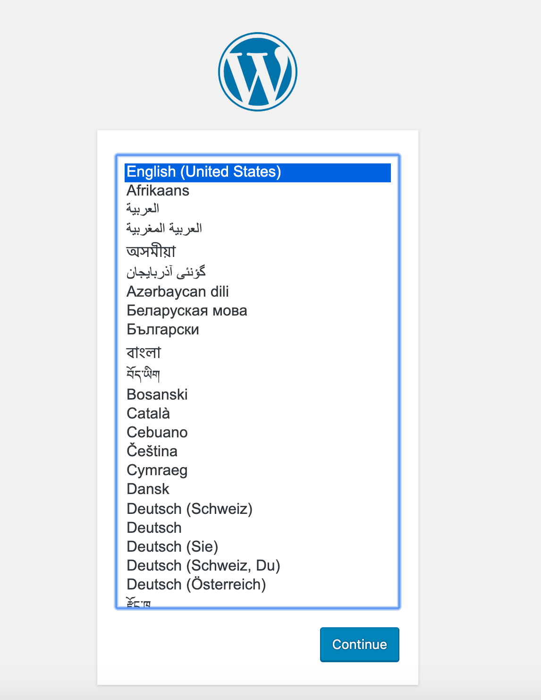

import { LinkCard, Steps } from '@astrojs/starlight/components';

_Xin chào, như vậy là bây giờ chúng ta sẽ đến với ngày thứ 18 của hành trình. Để quản lý số
lượng lớn máy chủ chạy Linux, chúng ta cần phải có một giải pháp an toàn và hiệu quả. **SSH 
(Secure Shell)** chính là lựa chọn đó - và đây là địa điểm tiếp theo của chúng ta._

**_Nếu bạn đã sẵn sàng thì lên đường thôi!!!_** 🚗  

## Giới thiệu điểm đến SSH

_5 điểm nhấn của vị trí này bao gồm:_

<Steps> 
1. _Shell (Vỏ) bảo mật._
2. _Giao thức mạng (nói chính xác thì đây là một dịch vụ mạng)._
3. _Cho phép giao tiếp an toàn._
4. _Có thể bảo mật cho bất kỳ dịch vụ mạng nào._
5. _Thường được sử dụng cho kết nối dòng lệnh từ xa._
</Steps>

_Khi chúng ta khởi tạo môi trường bằng Vagrant, SSH đã được cấu hình sẵn, do đó chúng ta chỉ
việc chạy câu lệnh ```vagrant ssh``` là đã kết nối được với máy ảo rồi. Tuy nhiên, trong
trường hợp máy ảo đó nằm trên các hạ tầng khác mà không cùng hệ thống mạng với chúng ta, SSH
cho phép tạo ra một **đường hầm kết nối (tunnel) an toàn** giữa máy khách và máy chủ để ngăn 
các tác nhân xấu can thiệp vào đường truyền và gây ảnh hưởng đến chúng ta._

_SSH trên mỗi máy chủ luôn được chạy ở **giao thức TCP, cổng số 22**. Chúng ta cần được cấp mã 
khóa hoặc thông tin truy nhập trước khi sử dụng SSH để giao tiếp với máy chủ._

### Thêm chút điểm nhấn...

Chúng ta thêm một card mạng vào máy ảo để thử sức, bằng cách tắt máy ảo. Mở cài đặt của máy ảo
trong VirtualBox rồi chọn Mạng (Networking).


Khởi động lại máy ảo. Chạy câu lệnh sau để kiểm tra sự tồn tại.

```bash title="Checking IPs..."
ip addr
```

### Kiểm tra SSH

_Chạy câu lệnh sau để xem trạng thái SSH._

```bash title="Checking SSH status..."
sudo systemctl status ssh
```


_Trong trường hợp nếu SSH không tồn tại trên máy ảo, chạy liên tiếp các câu lệnh sau để thêm vào
hệ thống (**đối với Ubuntu**)._

```bash title="Installing SSH..."
sudo apt install OpenSSH-server
sudo ufw allow ssh
sudo ufw reload
```

### Kết nối SSH

_Đối với hệ điều hành Windows, để sử dụng SSH chúng ta có hai cách, một là **kết nối qua dòng 
lệnh**, cách còn lại là sử dụng **Putty**._

#### Putty

_Cài đặt Putty vô cùng đơn giản bằng hướng dẫn **[này](https://www.cuit.columbia.edu/putty)**._ 


_Sau đó, bấm **Mở (Open)**. Chúng ta sẽ thấy một cảnh báo - Chọn **Có (Yes)** để tiếp tục, 
vì đây là hệ thống của chúng ta._


_Nhập tên đăng nhập và mật khẩu vào để kết nối. **Hoàn tất**._

#### Kết nối qua dòng lệnh

_Một cách kết nối an toàn hơn đó là sử dụng mã khóa, bởi lẽ trong trường hợp nếu **lộ tên đăng nhập
hoặc mật khẩu (hoặc cả hai)** thì tin tặc có thể chiếm quyền kiểm soát máy chủ ngay lập tức._

_Mã khóa được cấp qua dòng lệnh là một **cặp khóa (khóa công - tư/public - private)** để xác thực hai
chiều. Việc tạo mã khóa vô cùng đơn giản bằng những bước sau đây._

<Steps>
1. _**Cài đặt SSH trên máy khách**. Bạn có thể tra Google ở đây._
2. _Chạy câu lệnh sau để tạo cặp khóa. Nếu bạn muốn tìm hiểu thêm về mã hóa, truy cập vào 
[đây](https://en.wikipedia.org/wiki/EdDSA#Ed25519). Cặp khóa sẽ lưu trong một thư mục nào
đó có đuôi ```.ssh/```, ví dụ như ```C:\Users\admin\.ssh```._

   ```bash title="Creating SSH key pairs..."
   ssh-keygen -t ed25519
   ``` 
3. _Sao chép mã khóa vào máy chủ, sử dụng câu lệnh sau._

   ```bash title="Copying SSH key pairs..."
   ssh-copy-id [username]@[ip]
   ```

4. _Kết nối trở lại bằng câu lệnh sau._

   ```bash title="Connecting via SSH..."
   ssh [username]@[ip]
   ```

5. _(**Tùy chọn**) Tăng bảo mật cho SSH bằng cách chỉ sử dụng passphrase hoặc chặn sử dụng mật
khẩu để đăng nhập. **Trên máy ảo**, chạy câu lệnh sau._

   ```bash title="Removing SSH password authentication method..."
   sudo nano /etc/ssh/sshd_config
   ```

6. _(**Tùy chọn**) Xóa chú thích (dấu ```#```) ở dòng ```PasswordAuthentication yes```, rồi điều 
chỉnh về ```no``` và lưu cấu hình. Chạy lại dịch vụ SSH bằng câu lệnh sau._

   ```bash title="Removing SSH password authentication method..."
   sudo systemctl reload sshd
   ```

</Steps>

## Giới thiệu về máy chủ Web

_Thực ra có rất nhiều cách để nói về máy chủ Web, nhưng trong phạm trù của bài viết này, ta sẽ đá
sang máy chủ Web với các công nghệ thuộc dạng **LAMP (Linux, Apache, MySQL, PHP)**._

_Ở bản gốc, chúng ta học cách dựng máy chủ Web bằng các câu lệnh khác nhau. Nhưng với việc công nghệ
phát triển, việc này xem chừng không còn trở nên phù hợp nữa. Để đẩy nhanh tốc độ vận hành, ta sẽ 
tiến hành cài đặt một hệ thống chạy **WordPress**, nhưng sử dụng **Docker** cho quá trình chạy. Bạn 
có thể tải Docker tại **[đây](https://docker.com/)**, sau đó cài đặt **Docker Compose** để chạy cụm 
container này. Chúng ta sẽ tìm hiểu Docker ở dịp khác._

_Sau đó, bạn hãy truy cập vào 
**[đây](https://github.com/anthony2708/cs101_devops/tree/main/src/assets/linux/code/wordpress)** để 
xem tất cả những tập tin sẽ được sử dụng cho việc dựng WordPress._

_Ngay sau đó, chạy câu lệnh sau để bắt đầu._

```bash title="Running the Compose..."
docker-compose up -d
docker-compose ps
```

_Truy cập và kiểm tra hệ thống để xem có bất kỳ sự cố nào hay không, nếu không, truy cập vào hệ thống
qua địa chỉ IP để tiến hành cài đặt WordPress._



**_Hoàn thành ngày thứ 18 của hành trình. Xin chân thành cảm ơn._**


## Tài liệu tham khảo 📚

_Mời mọi người chuyển sang trang này để theo dõi tất cả tài liệu liên quan trong giai đoạn 3, 
để giúp bản thân có được những tài liệu hữu ích về Linux trong làm việc với DevOps._

<LinkCard
  title="Ngày 18 - Tham khảo"
  href="../../../reference/linux/day14"
/>

_Hẹn gặp mọi người ở những ngày tiếp theo._ 🚀