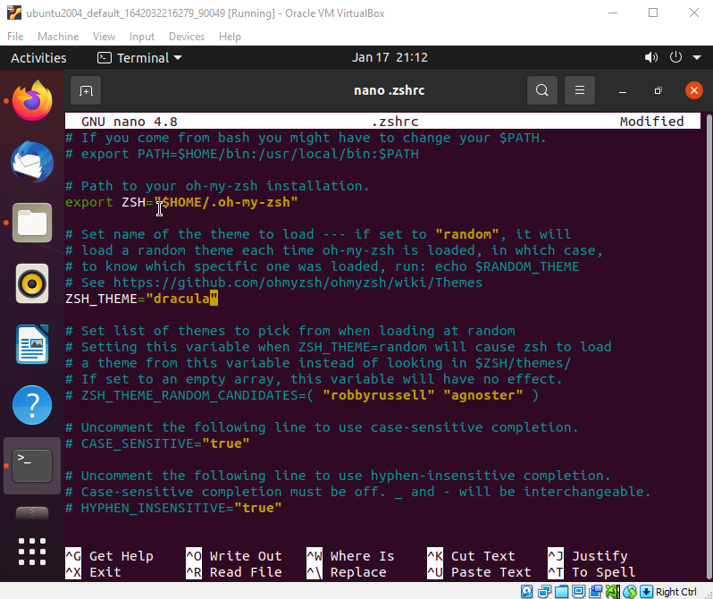

import { LinkCard, FileTree } from '@astrojs/starlight/components';

_Thực ra đây sẽ là một ngày mà mình sẽ tập trung nhiều vào ZSH và những thứ liên quan. Đối với 
câu chuyện máy trạm thì ngay ở **[đây](https://youtu.be/jeEslAtHfKc)** có một video để mọi người 
có thể theo dõi._

_Hành trình của mình trong ngày thứ 20 sẽ đi qua các nội dung liên quan đến các chức năng của
**ZSH** cũng như các **dotfiles** (**là các tập tin có dấu chấm phía trước tên gọi**)._

**_Nào, chúng ta bắt đầu ngày thứ 20 của hành trình thôi!_** 🚕

## .dotfiles

_Các tập tin có dấu chấm phía trước tên thường là những tập tin cấu hình quan trọng đối với hệ điều
hành Linux._

_Ví dụ như cây thư mục sau._

<FileTree>
- 90DaysOfDevOps/
- .bash_history
- .bash_logout
- .bashrc
- bash.sh
- .cache/
- .config/
- ...
</FileTree>

## ZSH 🖥

_Đây là một Shell tương tự như Bash nhưng có tính năng tốt hơn: Tự hoàn thành câu lệnh, tự động tìm
kiếm tập tin, tích hợp biểu diễn thông dụng (regex), câu lệnh rút gọn và một số hỗ trợ về giao diện._

### Cài đặt và sử dụng
_Để cài đặt ZSH, sử dụng câu lệnh sau để cài đặt và sử dụng._

```bash title="Installing zsh..."
sudo apt install zsh
zsh
```


_Khi màn hình này xuất hiện, **chọn số 1**, và sau đó tiếp tục có thể **chọn số 0** để chỉ tạo một 
tập tin ```.zshrc``` duy nhất. Lúc này ta có thể dùng câu lệnh sau để tìm tập tin và đổi shell._

```bash title="Checking files and changing shell..."
ls -la | grep .zshrc
chsh -s $(which zsh)
which $SHELL
```


### Trang trí với 0hMyZSH

_Để có một số giao diện đẹp hơn, hãy sử dụng OhMyZSH, và mọi người có thể tìm hiểu tại 
**[đây](https://ohmyz.sh/)**._

_Để tải OhMyZSH về máy và cấu hình các tính năng, lần lượt chạy các câu lệnh sau._

```bash
sh -c "$(curl -fsSL https://raw.githubusercontent.com/ohmyzsh/ohmyzsh/master/tools/install.sh)"
git clone https://github.com/zsh-users/zsh-autosuggestions.git
git clone https://github.com/zsh-users/zsh-syntax-highlighting.git
$ZSH_CUSTOM/plugins/zsh-autosuggestions
$ZSH_CUSTOM/plugins/zsh-syntax-highlighting
nano ~/.zshrc 
```
_Ở tập tin ```.zshrc```, điều chỉnh như sau: ```plugins=(git zsh-autosuggestions zsh-syntax-highlighting)```_

## Tiện ích mở rộng

_Mọi người có thể cài thêm một số tiện ích mở rộng kèm theo như trong đường dẫn 
**[này](https://extensions.gnome.org/)**. Các tiện ích được lựa chọn bao gồm danh sách sau._

- _Caffeine_
- _CPU Power Manager_
- _Dash to Dock_
- _Desktop Icons_
- _User Themes_

## Các phần mềm được cài đặt ⚙

_Hãy sử dụng câu lệnh quen thuộc để cài đặt toàn bộ các tiện ích dưới đây._

- _VSCode_
- _azure-cli_
- _containerd.io_
- _docker_
- _docker-ce_
- _google-cloud-sdk_
- _insomnia_
- _packer_
- _terminator_
- _terraform_
- _vagrant_

```bash title="Installing apps..."
sudo apt install [name]
```

## Giao diện tối 🌃

_Giao diện **[Dracula](https://draculatheme.com/)** sẽ là một giao diện phù hợp cho việc 
tiếp tục theo đuổi hành trình của chúng ta. Sau khi cài đặt xong, hãy cấu hình tập tin 
```.zshrc``` như hình dưới._



_Cuối cùng là cấu hình giao diện cho cửa sổ lệnh theo hướng dẫn tại 
**[đây](https://draculatheme.com/gnome-terminal)**._

**_Hoàn thành chặng đường một tuần tại làng Linux._**

## Tài liệu tham khảo 📚

_Mời mọi người chuyển sang trang này để theo dõi tất cả tài liệu liên quan trong giai đoạn 3, 
để giúp bản thân có được những tài liệu hữu ích về Linux trong làm việc với DevOps._

<LinkCard
  title="Ngày 20 - Tham khảo"
  href="../../../reference/linux/day14"
/>

_Hẹn gặp mọi người ở những ngày tiếp theo, nơi mà chúng ta sẽ nói về Mạng máy tính và các vấn
đề liên quan đến DevOps._ 🚀