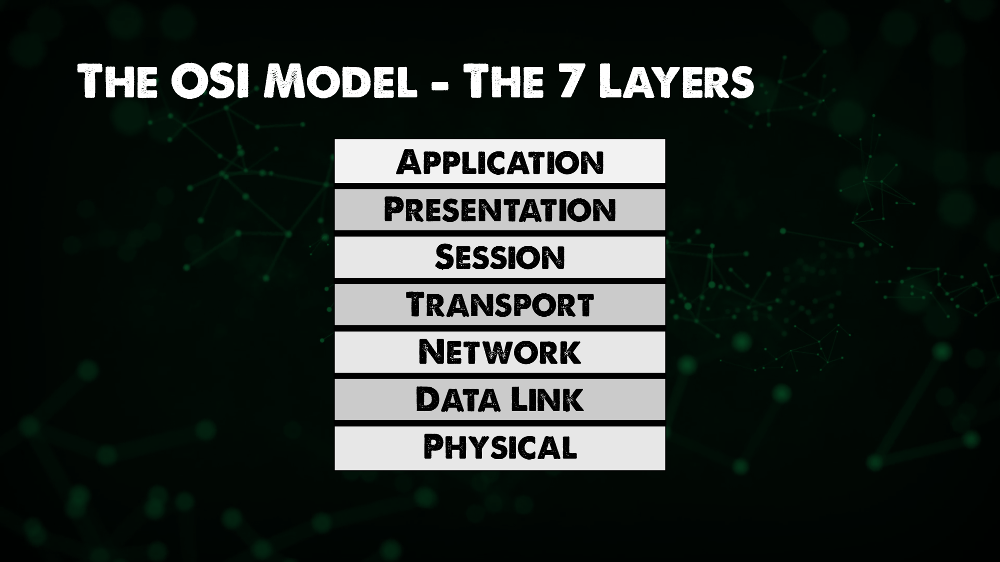

import { LinkCard, Steps } from '@astrojs/starlight/components';

_Xin chào, đây là ngày thứ 22 của hành trình 90 ngày. Và đây là lúc chúng ta sẽ điểm qua **mô 
hình OSI** - mô hình 7 tầng cho tất cả hệ thống mạng toàn cầu. Chúng ta có hai giải pháp lưa
chọn ở đây._

_Nếu bạn chọn **giải pháp video**, dưới đây là hai video để bạn theo dõi._

- [The OSI Model: A Practical Perspective - Layers 1/2/3](https://www.youtube.com/watch?v=LkolbURrtTs&list=PLIFyRwBY_4bRLmKfP1KnZA6rZbRHtxmXi&index=3)
- [The OSI Model: A Practical Perspective - Layers 4/5+](https://www.youtube.com/watch?v=0aGqGKrRE0g&list=PLIFyRwBY_4bRLmKfP1KnZA6rZbRHtxmXi&index=4)

**_Nếu bạn chọn giải pháp tiếp theo, hãy sẵn sàng để tham quan cùng mình nào!!!_** ⛺

## Câu chuyện đầu tiên...

_Ở thời điểm chưa có mạng máy tính, để có thể trao đổi dữ liệu giữa hai máy tính với nhau, 
người ta thường gắn một **thiết bị lưu trữ vào một máy**, sao chép dữ liệu rồi chuyển sang **máy
còn lại**. Mạng máy tính xuất hiện, như một cách **loại bỏ hoàn toàn** thiết bị sao chép này, và
tất nhiên việc sao chép dữ liệu qua Mạng cũng phải có một bộ quy tắc cụ thể. Bộ quy tắc này
được gọi là **mô hình OSI**._ 

_Mô hình OSI gồm có bảy tầng khác nhau, đi từ dưới lên trên, cụ thể như sau._

<Steps>
1. _**Tầng Vật lý (Physical)**: Chứa thông tin về mặt **vật lý (dây cáp, sóng không dây)** của thiết bị
giúp chúng ta truyền dữ liệu. Một số thiết bị hoạt động ở đây là **hub** hoặc **bộ lặp (repeater)**._
2. _**Tầng Liên kết dữ liệu (Data Link)**: Tầng này giúp đóng gói dữ liệu dưới dạng các **khung (frame)**
để truyền đi. Tầng này sửa lỗi liên quan đến tầng vật lý, và **địa chỉ MAC (định danh thiết bị mạng)** 
được đưa vào ở tầng này. **Bộ chuyển mạch (Switch)** hoạt động ở đây._
3. _**Tầng Mạng (Network)**: Vào hôm trước, ta nhắc đến **Bộ chuyển mạch cấp 3, Bộ định tuyến (Router)** 
hay **máy tính (Host)** - các thiết bị đó hoạt động ở tầng này. Tầng này có nhiệm vụ phân phối dữ liệu từ 
điểm đầu đến điểm cuối. Đây cũng là nơi **địa chỉ IP** hoạt động._
4. _**Tầng Giao vận (Transport)**: Tầng này phân biệt các luồng dữ liệu, vận chuyển dữ liệu giữa các dịch vụ
của các máy tính khác nhau. Tầng này thường sẽ có các **cổng** (SSH như đã từng nói nằm ở cổng số **22**)._
5. **_Tầng Phiên (Session)_**
6. **_Tầng Biểu diễn (Presentation)_**
7. **_Tầng Ứng dụng (Application)_**
</Steps>

_Đối với ba tầng còn lại, hãy xem bài viết **[này](https://www.geeksforgeeks.org/tcp-ip-model/)** để hiểu rõ hơn._

## MAC và IP

_Tại sao vừa có MAC vừa có IP? Lý do đơn giản là vì địa chỉ MAC chỉ có tác dụng trong việc liên lạc **giữa các thiết bị
kết nối trực tiếp với nhau**. Cứ tưởng tượng MAC nó giống cách gọi nhà dân gian: **Ngã tư thứ 3, nhà thứ 2 dãy bên trái**
chẳng hạn._

_IP thì nó lại gắn liền với gói dữ liệu đó, định danh từ đầu đến cuối. IP thì trông nó y như cách gọi số nhà sau: 
**123/24/25 Đường A, Phường 5, Quận 8, Thành phố Hồ Chí Minh** chẳng hạn._

_Chúng ta cũng sẽ tìm hiểu về **Giao thức phân giải địa chỉ (ARP)** trong chặng tiếp theo._

## Hành trình bất tận

_Dưới đây là cách mà gói tin được gửi đi từ máy A đến máy B._

<Steps>
1. _Đầu tiên dữ liệu sẽ được **đóng gói** lại từ tầng 7 xuống tầng 5._ 
2. _Dữ liệu chuyển xuống **tầng 4 (Giao vận)**. Một header chứa thông tin **giao thức (TCP/UDP)** và **cổng (nguồn/đích)** sẽ 
được thêm vào. Thông tin dữ liệu và cổng bây giờ gọi là **phân đoạn (segment)**._
3. _Phân đoạn chuyển xuống **tầng 3 (Mạng)**. Một header chứa thông tin **địa chỉ IP (nguồn/đích)** sẽ được thêm vào. Phân đoạn 
trở thành **gói tin (packet)**._
4. _Gói tin chuyển xuống **tầng 2 (Liên kết dữ liệu)**. Một header chứa thông tin **MAC (nguồn/đích)** sẽ được thêm vào. Gói tin 
trở thành **khuôn (frame)**_
5. _Khuôn thông tin được chuyển đổi thành **tín hiệu nhị phân (0 - 1)** và **truyền đi bằng cáp/không dây**._
6. _Gói tin khi đến máy còn lại, thực hiện **mở gói từ bước 5 quay về bước 1** của quá trình này và **so khớp dữ liệu**._
</Steps>

**_Đó là tất cả những nội dung trong ngày 22._**

## Tài liệu tham khảo 📚

_Mời mọi người chuyển sang trang này để theo dõi tất cả tài liệu liên quan trong giai đoạn 4, 
để giúp bản thân có được những tài liệu hữu ích về Mạng máy tính trong làm việc với DevOps._

<LinkCard
  title="Ngày 22 - Tham khảo"
  href="../../../reference/network/day21"
/>

_Hẹn gặp mọi người ở những ngày tiếp theo._ 🚀