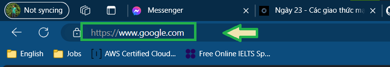
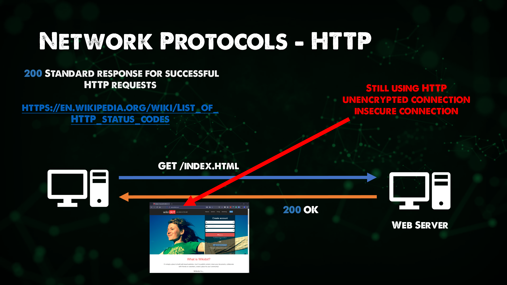

import { LinkCard } from '@astrojs/starlight/components';

_Hello, xin chào mọi người, đã rất lâu rồi mình mới lại có dịp thực hiện trở lại hành trình 90
ngày cùng DevOps này. Và tất nhiên, sự trở lại này còn mang nhiều ý nghĩa, khi những kiến thức
mới toanh với cách thể hiện mới cũng sẽ xuất hiện. **Mọi người đã sẵn sàng cùng mình lăn bánh 
tiếp chưa?**_

_Nếu thích phiên bản video, hãy chọn vào 
**[đây](https://www.youtube.com/watch?v=E5bSumTAHZE&list=PLIFyRwBY_4bRLmKfP1KnZA6rZbRHtxmXi&index=12)**
để tiếp tục nha._

**_Nào, hãy đi cùng chúng tôi!_** 🚗

## Các giao thức thân thuộc nhất

_Để mà nói hết về các giao thức như phạm vi bài gốc thì đúng là chắc viết không kịp mất, do đó ở
bản Việt, mình sẽ chỉ đề cập đến những giao thức có thể nói là gần gũi nhất với chúng ta._

**_Liệt kê một vòng quanh các giao thức nha._**

### ARP - Giao thức phân giải địa chỉ

_Một giao thức có thể nói là sống còn của Mạng máy tính. Mỗi máy tính, cũng giống như mỗi căn nhà, 
**đều có một địa chỉ**. Để các máy tính liên lạc được với nhau, người ta sẽ dùng 
**IP (Giao thức Internet)**. Mỗi địa chỉ IP sẽ lại đước gán với địa chỉ gốc của chính máy tính đó 
(tức là **địa chỉ MAC**). Việc phân giải từ IP sang MAC để hiểu và trao đổi giữa máy tính với nhau 
phải sử dụng giao thức phân giải địa chỉ, gọi là **ARP (Address Resolution Protocol)**._

### DNS - Giao thức phân giải tên miền

_Hãy nhìn vào địa chỉ này. Mọi người còn nhớ câu chuyện về địa chỉ mà mình đề cập ở đầu giai đoạn 
này không?_

_Nếu còn nhớ, hãy tưởng tượng nha, giữa việc đi tìm tọa độ nhà bạn bằng **vĩ độ/kinh độ** và tìm theo 
**địa chỉ bình thường** (có số nhà, tên đường đầy đủ) thì mọi người sẽ **chọn cách nào?** Tất nhiên cũng
tùy thời điểm, nhưng hầu như chẳng ai lại đi trả lời địa chỉ bằng cách nêu ra một con số kiểu **10
độ vĩ Bắc, 100 độ kinh Đông** bao giờ cả._

_Mạng máy tính cũng như vậy. Trên môi trường Mạng, bản chất như đã nói phía trên, để liên lạc với 
nhau thường người ta dùng IP. Mà IP lại có hai loại là **bản 4 (kiểu 192.168.1.1)** và **bản 6 (bản
6 quá dài để viết vào đây)**, thế chả lẽ muốn truy cập Google tìm kiếm gì đó lại phải đi tìm số như 
ngày xưa (**kiểu Những trang vàng à**)???_ 🤣

_**DNS (Domain Name System) - Giao thức phân giải tên miền** sẽ giúp bạn quên đi cảnh phải tìm kiếm địa 
chỉ đau khổ mà phải **nhớ nhiều số** như vậy nữa. Bây giờ, khi mở bất kỳ trình duyệt lên, chỉ cần gõ 
[google.com](google.com) thì ngay lập tức, DNS sẽ làm nhiệm vụ đi tìm con số này cho mọi người và truy cập 
vào đúng hệ thống mọi người cần._

### HTTP/HTTPS - Giao thức truyền tải siêu văn bản

_Sự khác nhau giữa HTTP và HTTPS chính là chữ **S - Secure (Bảo mật)**. Điều này có nghĩa là, đối với HTTPS, các kết nối 
sẽ được mã hóa bằng TLS giữa máy khách và máy chủ, giúp tăng **tính tối mật, toàn vẹn và khả dụng** về quyền riêng tư. 
Tất nhiên, hầu hết các kết nối vào các trang mạng đều là HTTPS, chỉ rất ít trang sử dụng HTTP và thường là các trang có 
địa chỉ kiểu **IP bản 4** (**lại IP bản 4, mình quá mệt mỏi với nó rồi**_ 🤣 _)._

_Vẫn còn đó rất nhiều giao thức khác mà mọi người có thể tìm hiểu thêm. Nhưng mà **khoan, dừng khoảng chừng hai giây!** Ủa
rồi có ai để ý rằng **chúng ta đang nhắc đến IP bản 4 hơi bị nhiều không?** Để mình kể cho mọi người nghe liền câu chuyện 
về loại IP này nhỉ..._

## Tản mạn về IP bản 4 và Mạng con

_IP bản 4 (IPv4) là một phiên bản mà ở đó, địa chỉ sẽ được đánh theo dạng **32 bits nhị phân** (**nhị phân là chỉ có 0 và 1 
thôi - máy tính không đủ thông minh để hiểu nhiều hơn hai số này**), và được chia thành **4 cụm (octets)**, tức là 
**8 bits * 4 cụm**._

_Đây là một số nhị phân: **0000 0011**, và đây là số thập phân tương ứng với nó: **3**. Với một số nhị phân độ dài **8 bits**, 
chúng ta có thể viết được đến tối đa là **256 số thập phân (0 - 255)** tương ứng. Như vậy, 1 cụm chỉ có thể viết được đến 255 
là cùng._

_Với 4 cụm, dãy địa chỉ IP tương ứng sẽ là **0.0.0.0 - 255.255.255.255**. Nhưng không phải địa chỉ nào cũng có thể sử dụng được._ 

_Số lượng địa chỉ tối đa có thể sử dụng trong IP bản 4 là **2^32 (2 lũy thừa 32)**, cỡ hơn **4 tỷ địa chỉ**. 
**Dân số thế giới gấp đôi**. Số lượng không đáp ứng nhu cầu. Bắt buộc phải tái sử dụng bằng cách **chia nhỏ**. Việc chia nhỏ sẽ
làm thành các **mạng con**._

_Chia mạng con, tức là chia địa chỉ lớn thành những **cụm địa chỉ nhỏ hơn**, có cùng **mặt nạ (mask)** giữa các thiết bị cùng 
mạng con để phục vụ giao tiếp liên tục. Điều này có hai lợi thế: **Dễ quản lý** và **dễ xử lý khi có sự cố xảy ra**._

- _Dễ quản lý nghĩa là **giảm tắc nghẽn mạng**, tăng hiệu quả sử dụng mạng hơn thông qua giới hạn số lượng địa chỉ trong mạ**ng** con._ 
- _Dễ xử lý khi có sự cố nghĩa là ngay khi bị tấn công, **vùng tấn công sẽ bị cô lập**, đảm bảo sự việc không bị lan rộng, 
gây nguy hiểm cho toàn hệ thống._

_Câu hỏi đặt ra là **ai sẽ giúp quản lý mạng con?** **Bộ định tuyến (router)** làm việc này chứ còn ai vào đây nữa!_ 🖥

**_Đấy là cách tiết kiệm dân gian mà ai cũng biết về IP, cũng là kết thúc cho ngày thứ 23 của hành trình._** ✅

## Tài liệu tham khảo 📚

_Mời mọi người chuyển sang trang này để theo dõi tất cả tài liệu liên quan trong giai đoạn 4, 
để giúp bản thân có được những tài liệu hữu ích về Mạng máy tính trong làm việc với DevOps._

<LinkCard
  title="Ngày 23 - Tham khảo"
  href="../../../reference/network/day21"
/>

_Hẹn gặp mọi người ở những ngày tiếp theo._ 🚀