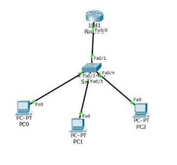
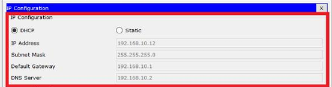

import { LinkCard } from '@astrojs/starlight/components';

:::note

_Dự là sẽ cung cấp một phiên bản dữ dội hơn cho ngày 24, nhưng vì lượng kiến thức của các ngày 
24-27 ở bản gốc là quá rộng và đôi khi là không liên quan, do đó đây sẽ là một câu chuyện hơi 
khác dành riêng trên series này._

**_Sẽ chỉ còn hai ngày 24-25 thay vì bốn ngày 24-27 của hành trình để phù hợp hơn với điều kiện
thực tế._**

:::

_Xin chào, đây là ngày thứ 24 của hành trình, thời điểm chúng ta tìm hiểu sơ nét về những câu
chuyện liên quan đến cách chúng ta xây dựng hệ thống mạng ngoài đời thực._

**_Hãy sẵn sàng để bắt đầu khám phá thôi!_** 🏕

## Cấu hình mạng - Chuyên muôn thuở

_Có thể nói, câu chuyện làm sao để dựng được một hệ thống mạng vận hành trơn tru phục vụ các tổ 
chức, doanh nghiệp hiển nhiên không phải là một việc gì đó đơn giản. Nhất là trong bối cảnh,
đang có rất nhiều tin tặc nhắm đến các hệ thống mạng như một đối tượng tấn công, uy hiếp sự an
toàn cho toàn vẹn dữ liệu._ 

_Chính vì lẽ đó, một hệ thống mạng được mô phỏng trên mô hình sẽ giúp hình dung ra những vấn đề
phát sinh, từ đó đưa ra những giải pháp phù hợp cho những thời điểm khác nhau._

_Hiện tại, có rất nhiều phần mềm có thể được dùng để mô phỏng hệ thống mạng. Trong phạm vi của 
bài viết này, mình sẽ đi sâu vào **Cisco Packet Tracer** - một trong những phần mềm được rất 
nhiều kỹ sư mạng sử dụng ngày nay._

## Các câu lệnh quen thuộc

_Cisco là một trong những đơn vị cung cấp các giải pháp mạng hàng đầu thế giới, và với Packet 
Tracer, một việc đơn giản mà các bạn cần làm trước khi có thể sử dụng nó là **tạo một tài khoản
hệ thống**. Hướng dẫn tạo sẽ có khi các bạn mở ứng dụng lần đầu tiên (**lưu ý: nó nằm ở dưới chân
màn hình**)._

**_Sau khi mở ứng dụng và đăng nhập, hãy dựng thử mô hình sau đây._**



_Chọn đúp vào bộ định tuyến R0._

### Đặt địa chỉ IP

_Đợi khỏi động, rồi đặt địa chỉ IP cho cổng fa0/0 bằng chùm lệnh sau._

```bash title="Setting up IP address..."

enable # Kích hoạt Bộ định tuyến
configure terminal # Vào chế độ cấu hình dòng lệnh
no ip domain-lookup # Ngăn việc phiên dịch các từ khóa lạ thành địa chỉ IP
interface fastEthernet0/0 # Vào cổng Bộ định tuyến
ip address 192.168.10.1 255.255.255.0
no shutdown
exit

```
_Lệnh ```no shutdown``` là lệnh yêu cầu mở cổng fa0/0. Không có lệnh này, cổng sẽ không
tự mở lên._ 

### Thiết lập cấp địa chỉ tư động - DHCP

_Sau đó, chúng ta sẽ tiến hành một yêu cầu là cấp địa chỉ IP tự động theo giao thức DHCP.
Thực hiện các câu lệnh sau trên bộ đinh tuyến._

```bash title="DHCP configuration"

ip dhcp pool dhclab # Đặt tên cho tập địa chỉ DHCP
network 192.168.10.0 255.255.255.0 # Dãy địa chỉ cấp cho các thiết bị đầu cuối
default-router 192.168.10.1 # Default gateway - Cửa ra mặc định cho các thiết bị mạng 
dns-server 192.168.10.2 # DNS Server - Địa chỉ máy chủ phân giải tên miền
exit

# Loại bỏ dãy địa chỉ bất kỳ ra khỏi tập DHCP
ip dhcp excluded-address 192.168.10.1 192.168.10.10
ip dhcp excluded-address 192.168.10.248 192.168.10.254
exit
write running-config # Ghi nhận hệ thống - Nếu không thực hiện, cấu hình sẽ bị xóa khi khởi động lại
```

### Kiểm tra

_Chọn vào từng thiết bị, vào **Thiết lập IP (IP Configuration)** và ở mục IPv4, chuyển sang **chế độ 
tự động (DHCP)** để lấy địa chỉ từ bộ đinh tuyến cấp._



**_Đó là những gì mà ngày 24 này mang đến và tất nhiên, vẫn còn 1 ngày 25 cho Giai đoạn 4 này
để phục vụ mọi người._**

## Tài liệu tham khảo 📚

_Mời mọi người chuyển sang trang này để theo dõi tất cả tài liệu liên quan trong giai đoạn 4, 
để giúp bản thân có được những tài liệu hữu ích về Mạng máy tính trong làm việc với DevOps._

<LinkCard
  title="Ngày 24 - Tham khảo"
  href="../../../reference/network/day21"
/>

_Hẹn gặp mọi người ở những ngày tiếp theo._ 🚀