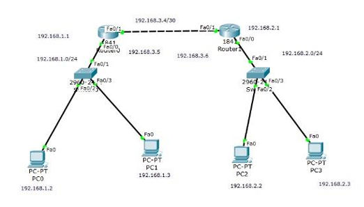
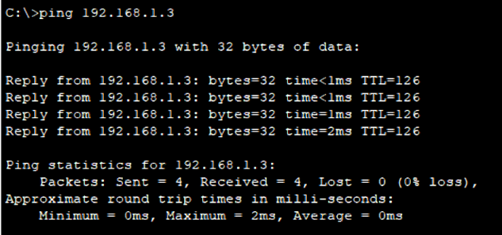

import { LinkCard, Steps } from '@astrojs/starlight/components';

_Xin chào, đây là **đoạn cuối** của giai đoạn 4 chuyến hành trình **"bất ổn"** 90 ngày cùng 
DevOps, và đây là lúc mà chúng ta sẽ đi sâu vào vai trò chính của bộ định tuyến - điều 
phối đường đi của các gói tin kết nối trong Mạng máy tính._

**_Hãy sẵn sàng lấy giấy bút ra, và bắt đầu chuyến hành trình ngay thôi nào!_** 🚕

## Định tuyến hệ thống mạng

**_Chúng ta bắt đầu bằng một sơ đồ như sau._**



### Lệnh định tuyến

_Câu lệnh định tuyến tương ứng thường được sử dụng để đánh trên các cổng như sau (ví dụ như 
trên bộ định tuyến R0)_

```bash title="Configuring routing..."

enable
configure terminal
interface fastEthernet0/1
ip address 192.168.3.5 255.255.255.0
no shutdown 
exit
ip route 192.168.2.1 255.255.255.0 192.168.3.6 
write running-config

```

_Câu lệnh ```ip route``` có ba tham số._

<Steps>
1. _**Địa chỉ cần đến**: Ở đây không phải địa chỉ cổng cần đến mà là địa chỉ đích mà gói tin 
gửi tới._
2. _**Mặt nạ mạng con**. Có thể xem lại ở **[Ngày 23](../day23)**._
3. _**Địa chỉ cổng đến (next hop)**: Đây mới là địa chỉ cổng mà gói tin cần đến để chuyển
tới đích._
</Steps>

:::note[Giải nghĩa lệnh]

_Như vậy câu lệnh phía trên mang ý nghĩa sau._ 

<details>

<summary>Câu lệnh chính xác</summary>

_Hãy điều hướng các gói tin đến địa chỉ **192.168.2.1**, mặt nạ là **255.255.255.0** 
thông qua cổng có địa chỉ **192.168.3.6** ở bộ định tuyến liền kề._

</details>

:::

### Kiểm tra

_Sau khi cấu hình xong ở các cổng và các máy thì việc kiểm tra chỉ cần thực hiện đơn giản bằng
cách gọi đến máy còn lại bằng câu lệnh sau._

```bash title="Pinging..."

ping 192.168.1.3

```



### Lưu ý

_Có một lưu ý không hề nhỏ dành cho những ai đang học về Mạng máy tính: Việc định tuyến
cần phải thực hiện **hai chiều**. Điều này là một trong ba nguyên tắc cơ bản của bảng định tuyến._

:::tip[3 nguyên tắc cơ bản của bảng định tuyến]

<Steps>

1. _Mỗi bộ định tuyến tự đưa ra quyết định của mình, dựa trên thông tin có được từ bảng._
2. _Việc một bộ định tuyến có thông tin bất kỳ trên bảng không đồng nghĩa các bộ khác có thông
tin đó._
3. _Thông tin định tuyến ở một đường bất kỳ chỉ có tính chất **một chiều**, không cung cấp 
thông tin ở chiều ngược lại._

</Steps>

:::

_Có rất nhiều câu lệnh khác mà chúng ta có thể dùng cả năm chỉ để tìm hiểu, tuy nhiên đây là
những gì cơ bản nhất mà series mang đến. Người ta gọi cách định tuyến như vừa rồi là **tĩnh** - 
trên thực tế việc định tuyến sẽ thường thực hiện **tự động** qua cấu hình các giao thức khác
như **RIPv2, OSPF, BGP (như Meta/Facebook đang sử dụng)**, v.v..._

_Mọi người có thể liên lạc trực tiếp với mình để được khám phá thêm những gì thú vị nhất liên quan
đến chủ đề này. **Đây cũng chính là phần kết của giai đoạn 4. Xin chào**._ 👋

## Tài liệu tham khảo 📚

_Mời mọi người chuyển sang trang này để theo dõi tất cả tài liệu liên quan trong giai đoạn 4, 
để giúp bản thân có được những tài liệu hữu ích về Mạng máy tính trong làm việc với DevOps._

<LinkCard
  title="Ngày 25 - Tham khảo"
  href="../../../reference/network/day21"
/>

_Hẹn gặp mọi người ở những ngày tiếp theo, nơi mà chúng ta sẽ nói về Điện toán đám mây và các 
vấn đề liên quan cực kỳ mật thiết đến DevOps._ 🚀